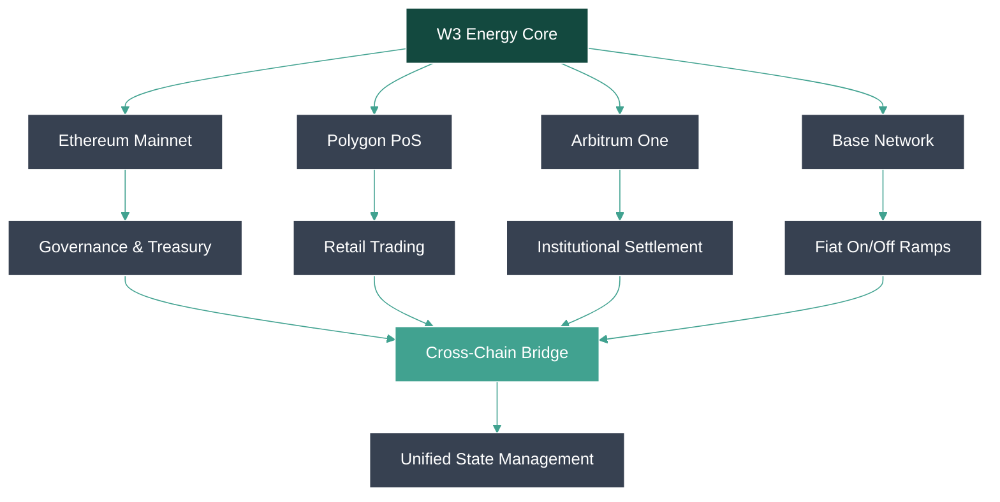
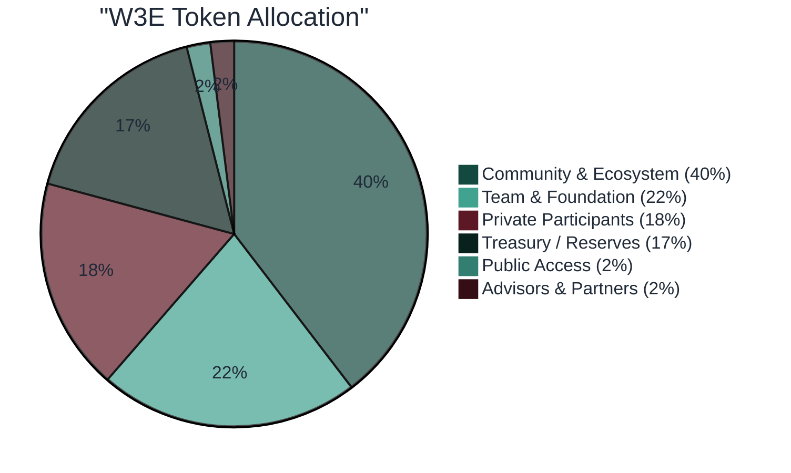
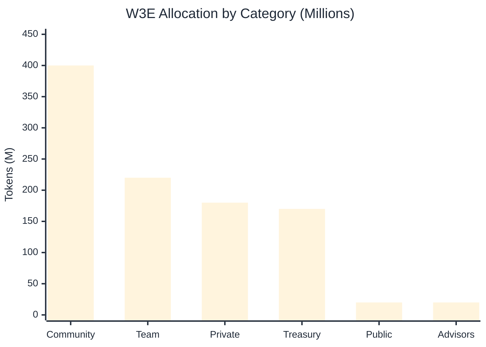
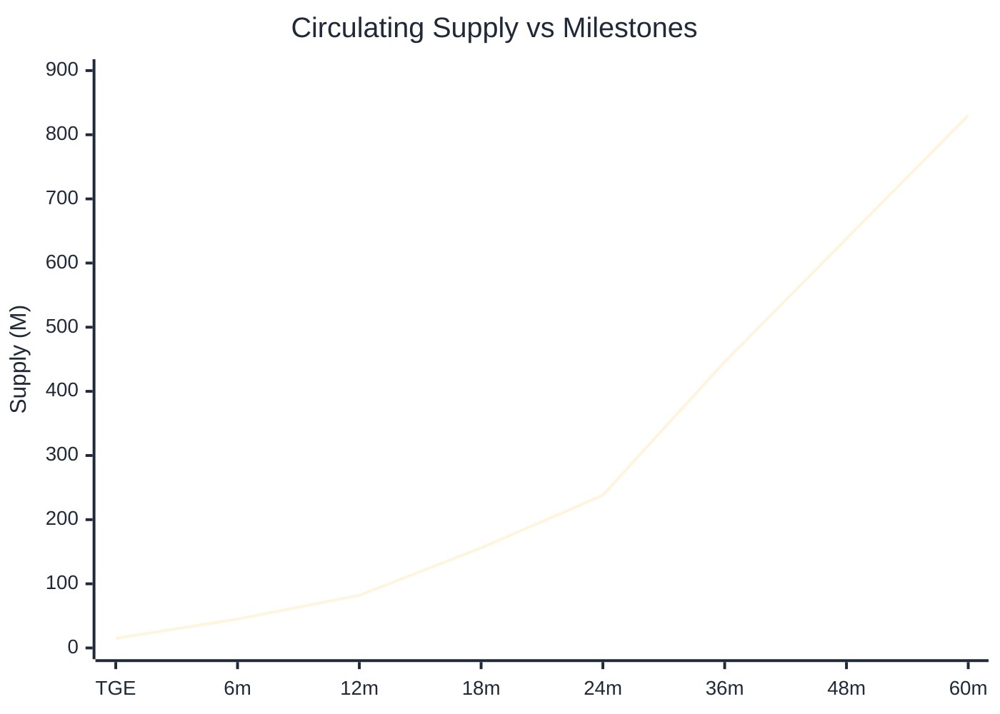
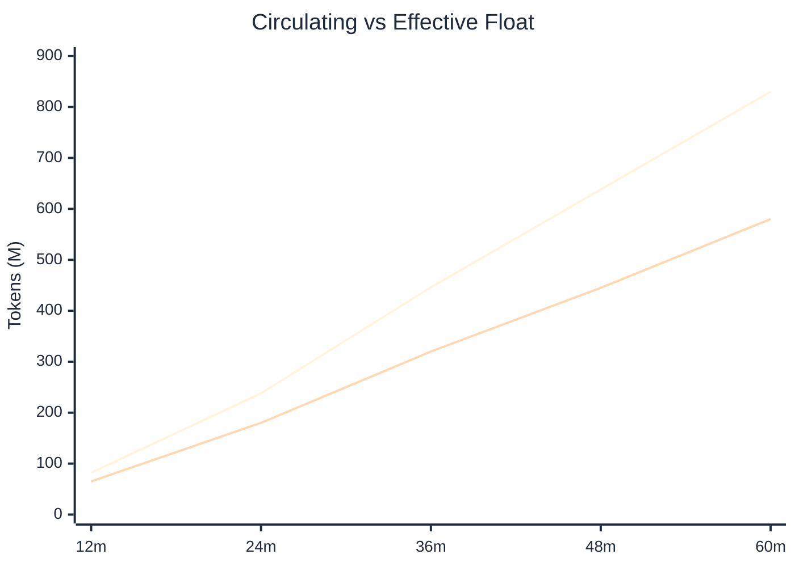
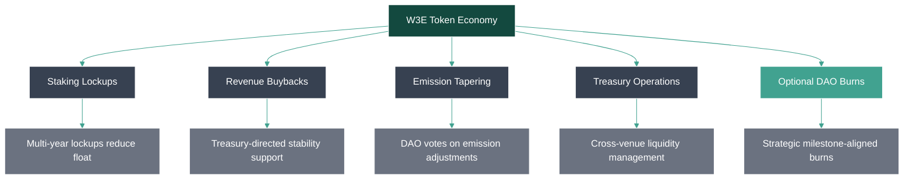
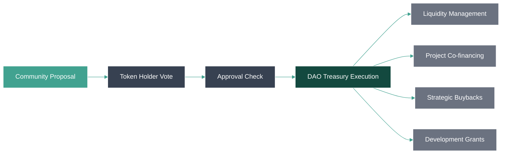
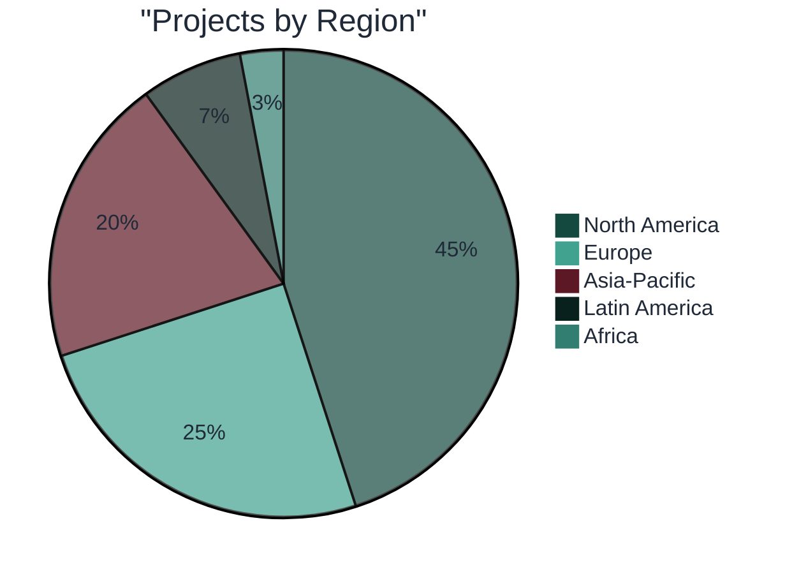

# Introduction

W3 Energy is the infrastructure protocol powering a new era of clean energy finance. Designed for institutional-grade issuance, on-chain governance, and transparent lifecycle management of renewable energy instruments— W3 Energy ensures every stakeholder can trust, automate, and scale in the emerging green capital ecosystem.

The W3 Energy ecosystem enables the tokenization of real-world energy assets (RWAs), facilitating direct investment in renewable energy projects through digital bonds (eBonds) and power purchase agreements (PPAs). By leveraging omnichain infrastructure, we create a seamless bridge between traditional energy finance and decentralized finance (DeFi).

---

## Platform Overview

W3 Energy operates as a comprehensive ecosystem that addresses the critical gap in renewable energy financing. Our platform consists of:

**Core Infrastructure:**

- **Modular infrastructure:**: On-chain issuance, automated distributions, lifecycle controls, carbon tracking, and audit-ready transparency.
- **Composable tooling:**: Open APIs, SDKs, and integrations crafted for energy finance systems, institutional workflows, and developer ecosystems.
- **Governance with clarity:**: Transparent on-chain governance and protocol evolution paths designed for trust and scalability.
- **Compliance-aware design**: Permission layers (e.g., KYC, jurisdictional controls) built-in—without compromising modularity
- **Scalable architecture:**: Starting with Ethereum + L2 deployment readiness, with multi-chain flexibility baked in from the start.

- **Energy Asset Tokenization**: Convert physical renewable energy projects into digital assets
- **eBonds Platform**: Issue and trade energy project bonds on-chain
- **PPA Marketplace**: Facilitate power purchase agreements between independent generators and consumers
- **Governance Framework**: Community-driven protocol management through W3E token holders
- **Omnichain Bridge**: Cross-chain compatibility for maximum accessibility


**Key Features:**

- Institutional-grade security and compliance
- Real-time project monitoring and reporting
- Automated revenue distribution through smart contracts
- Multi-chain deployment for global accessibility
- Integration with traditional energy markets

## Ecosystem Landscape

The renewable energy sector faces a $4 trillion annual financing gap, with traditional funding mechanisms proving insufficient for the scale of transition required. W3 Energy addresses this through:

**Market Opportunity:**

- Global renewable capacity needs to triple by 2030
- $130 trillion investment required for net-zero transition
- Growing institutional demand for ESG-compliant investments
- Increasing adoption of blockchain in traditional finance

**Competitive Advantages:**

- First-mover advantage in energy RWA tokenization
- Deep partnerships with energy developers and institutions
- Regulatory-compliant framework designed for institutional adoption
- Proven track record with pilot projects across multiple regions

**Ecosystem Partners:**

- Renewable energy project developers
- Institutional investors and family offices
- Energy utilities and grid operators
- Regulatory bodies and compliance partners
- Technology infrastructure providers

## Getting Started

**For Investors:**

1. **Whitelist Registration**: Join our institutional whitelist at [w3-energy.org/waitlist](https://w3-energy.org/waitlist.html)
2. **KYC/AML Compliance**: Complete institutional verification process
3. **Wallet Setup**: Connect compatible Web3 wallet (MetaMask, WalletConnect)
4. **Token Acquisition**: Participate in governance through W3E token holdings
5. **Project Investment**: Browse and invest in vetted renewable energy projects

**For Developers:**

1. **Documentation Review**: Explore our comprehensive API and SDK documentation
2. **Testnet Access**: Deploy and test on our testnet environment
3. **Integration Support**: Access developer resources and community support
4. **Mainnet Deployment**: Launch production integrations with full support

**For Energy Projects:**

1. **Project Assessment**: Submit renewable energy projects for evaluation
2. **Due Diligence**: Complete technical and financial review process
3. **Tokenization Setup**: Structure project as Special Purpose Vehicle (SPV)
4. **Market Launch**: List tokenized assets on W3 Energy platform
5. **Ongoing Management**: Monitor performance and manage investor relations

---

## Trust & Security

### Overview

Security and trust form the foundation of W3 Energy's institutional-grade platform. Our multi-layered security approach combines battle-tested smart contract architecture, comprehensive audit processes, and institutional-grade operational security to protect user assets and maintain platform integrity.

**Security Principles:**

- **Defense in Depth**: Multiple security layers with no single points of failure
- **Transparency**: Open-source components with public audit reports
- **Continuous Monitoring**: Real-time security monitoring and incident response
- **Regulatory Compliance**: Adherence to institutional security standards
- **Community Oversight**: Decentralized governance with security-focused proposals

### Institutional Security

**Smart Contract Security:**

- Multi-signature treasury management with hardware security modules (HSMs)
- Time-locked governance proposals with emergency pause mechanisms
- Role-based access controls with principle of least privilege
- Formal verification of critical contract functions
- Comprehensive test coverage exceeding 95%

**Operational Security:**

- SOC 2 Type II compliance for infrastructure operations
- 24/7 security operations center (SOC) monitoring
- Incident response procedures with defined escalation paths
- Regular penetration testing by third-party security firms
- Employee security training and background verification

**Infrastructure Security:**

- Multi-cloud deployment with geographic redundancy
- End-to-end encryption for all data transmission
- Zero-trust network architecture with micro-segmentation
- Automated backup and disaster recovery procedures
- Compliance with ISO 27001 and SOX requirements

### DeFi Incident History & W3E Mitigations

Learning from the DeFi ecosystem's security challenges, W3 Energy implements specific mitigations against common attack vectors:

**Bridge Security:**

- **Risk**: Cross-chain bridge exploits (>$2B lost in 2022-2023)
- **Mitigation**: Conservative bridge design with multiple validation layers and withdrawal delays

**Oracle Manipulation:**

- **Risk**: Price feed manipulation and flash loan attacks
- **Mitigation**: Multiple oracle sources with deviation checks and time-weighted average pricing

**Governance Attacks:**

- **Risk**: Malicious proposals and vote buying
- **Mitigation**: Proposal delays, execution timeouts, and emergency governance mechanisms

**Smart Contract Bugs:**

- **Risk**: Logic errors and reentrancy attacks
- **Mitigation**: Formal verification, extensive testing, and gradual deployment with monitoring

**Economic Exploits:**

- **Risk**: MEV attacks and sandwich trading
- **Mitigation**: Private mempool integration and MEV protection mechanisms

### Audit Reports

**Completed Audits:**

- **Trail of Bits** (Q4 2024): Core protocol smart contracts - [View Report](#)
- **Consensys Diligence** (Q1 2025): Cross-chain bridge infrastructure - [View Report](#)
- **OpenZeppelin** (Q2 2025): Governance and tokenomics contracts - [View Report](#)

**Ongoing Security Reviews:**

- Continuous monitoring through Forta network
- Real-time vulnerability scanning with Slither and Mythril
- Community security reviews through Code4rena competitions
- Quarterly security assessments by rotating audit firms

**Public Verification:**

- All smart contracts verified on Etherscan and block explorers
- Open-source repository with comprehensive documentation
- Public test suites demonstrating security properties
- Bug bounty program with responsible disclosure process

### Bug Bounty Program

**Scope & Rewards:**

- **Critical Vulnerabilities**: Up to $500,000 USDC
- **High Severity**: Up to $100,000 USDC
- **Medium Severity**: Up to $25,000 USDC
- **Low Severity**: Up to $5,000 USDC

**Program Details:**

- **Platform**: Managed through Immunefi with HackerOne integration
- **Scope**: All production smart contracts and critical infrastructure
- **Response Time**: 24-hour acknowledgment, 7-day initial assessment
- **Disclosure**: Coordinated disclosure with 90-day publication timeline

**Eligible Vulnerabilities:**

- Smart contract logic errors and reentrancy issues
- Cross-chain bridge security vulnerabilities
- Governance mechanism exploits and economic attacks
- Oracle manipulation and price feed issues
- Access control bypasses and privilege escalation

**Out of Scope:**

- Known issues documented in audit reports
- Theoretical attacks without proof of concept
- Social engineering and phishing attacks
- Third-party integrations and external dependencies

---

## Core Concepts

### RWA Energy Tokenization

Real-World Asset (RWA) tokenization transforms physical renewable energy projects into digital assets that can be traded, financed, and managed on-chain. W3 Energy's tokenization framework creates a bridge between traditional energy infrastructure and decentralized finance.

**Tokenization Process:**

1. **Asset Identification**: Renewable energy projects undergo technical and financial due diligence
2. **Legal Structure**: Projects are structured as Special Purpose Vehicles (SPVs) with clear ownership rights
3. **Digital Representation**: Physical assets are represented as ERC-20 tokens with embedded metadata
4. **Compliance Integration**: Tokens include built-in compliance features for regulatory requirements
5. **Lifecycle Management**: Automated processes handle revenue distribution and asset management

**Token Types:**

- **Project Tokens**: Represent ownership stakes in specific renewable energy projects
- **Revenue Tokens**: Entitle holders to cash flows from energy generation
- **Carbon Credit Tokens**: Digitize environmental attributes and carbon offsets
- **Infrastructure Tokens**: Represent shared infrastructure like transmission lines

**Benefits:**

- **Fractional Ownership**: Enable smaller investors to participate in large-scale projects
- **Liquidity**: Create secondary markets for traditionally illiquid energy assets
- **Transparency**: Provide real-time visibility into project performance and financials
- **Global Access**: Remove geographic barriers to energy investment
- **Automated Management**: Reduce operational overhead through smart contracts

### eBonds & Project Finance

Energy Bonds (eBonds) are blockchain-native debt instruments that finance renewable energy projects through decentralized capital markets. These digital bonds combine traditional project finance structures with DeFi innovation.

**eBond Structure:**

- **Principal**: Initial capital raised for project development
- **Coupon Rate**: Fixed or variable interest payments to bondholders
- **Maturity**: Defined repayment schedule aligned with project cash flows
- **Collateral**: Physical energy assets and revenue streams backing the bond
- **Covenants**: Smart contract-enforced compliance requirements

**Issuance Process:**

1. **Project Evaluation**: Technical and financial assessment by W3 Energy team
2. **Rating Assignment**: Credit rating based on project fundamentals and risk factors
3. **Legal Documentation**: Smart contract deployment with bond terms and conditions
4. **Marketing Period**: Institutional investor outreach and subscription process
5. **Settlement**: Automated fund distribution and bond token issuance

**Investor Benefits:**

- **Predictable Returns**: Stable cash flows from long-term energy contracts
- **ESG Compliance**: Direct investment in climate-positive infrastructure
- **Diversification**: Access to uncorrelated renewable energy returns
- **Transparency**: Real-time monitoring of project performance and payments
- **Liquidity Options**: Secondary market trading through DEX integration

**Risk Management:**

- **Credit Enhancement**: Insurance and guarantee structures to protect investors
- **Performance Monitoring**: IoT sensors and satellite data for asset verification
- **Default Procedures**: Automated liquidation and recovery processes
- **Regulatory Compliance**: Adherence to securities laws and energy regulations

### Power Contracts (PPAs)

Power Purchase Agreements (PPAs) are long-term contracts for the sale of electricity from renewable energy projects. W3 Energy digitizes and automates PPA management through smart contracts, creating new opportunities for both generators and consumers.

**Digital PPA Features:**

- **Automated Execution**: Smart contracts handle payment processing and delivery confirmation
- **Real-time Settlement**: Hourly or daily settlement based on actual energy production
- **Price Discovery**: Dynamic pricing mechanisms reflecting market conditions
- **Risk Management**: Built-in hedging and insurance products
- **Compliance Tracking**: Automated reporting for renewable energy certificates (RECs)

**PPA Types:**

- **Physical PPAs**: Direct electricity delivery with grid integration
- **Virtual PPAs**: Financial contracts without physical delivery (Contract for Differences)
- **Synthetic PPAs**: Blockchain-native contracts using oracle price feeds
- **Peer-to-Peer PPAs**: Direct trading between distributed energy resources

**Market Participants:**

- **Generators**: Renewable energy project owners seeking long-term revenue certainty
- **Offtakers**: Corporations, utilities, and institutions purchasing clean energy
- **Traders**: Market makers providing liquidity and risk management services
- **Aggregators**: Platforms bundling smaller projects for institutional buyers

**Benefits:**

- **Price Certainty**: Long-term contracts reduce revenue volatility for generators
- **Cost Savings**: Direct procurement eliminates intermediary fees and markups
- **Sustainability Goals**: Enable corporate renewable energy commitments
- **Grid Stability**: Provide predictable supply for grid planning and operations
- **Innovation**: Enable new business models like community solar and virtual power plants

### Omnichain Infrastructure

W3 Energy's omnichain architecture enables seamless interaction across multiple blockchain networks, maximizing accessibility and liquidity for energy assets while maintaining security and compliance.

**Multi-Chain Strategy:**

- **Ethereum**: Primary network for governance and institutional assets
- **Polygon**: Low-cost transactions for retail participation and micropayments
- **Arbitrum**: Layer 2 scaling for high-frequency trading and settlements
- **Base**: Coinbase integration for institutional onboarding
- **Future Chains**: Expansion to Solana, Avalanche, and other ecosystems

**Cross-Chain Components:**

- **Unified Liquidity**: Aggregate liquidity across all supported networks
- **Asset Bridging**: Secure transfer of tokens between different blockchains
- **State Synchronization**: Consistent data and governance across chains
- **Gas Optimization**: Intelligent routing to minimize transaction costs
- **Compliance Consistency**: Uniform regulatory compliance across all networks

**Technical Architecture:**



**Security Measures:**

- **Multi-Signature Bridges**: Require multiple validators for cross-chain transfers
- **Time Delays**: Withdrawal delays for large transfers to prevent rapid drainage
- **Circuit Breakers**: Automatic pausing during unusual activity or market stress
- **Validator Diversity**: Geographically and organizationally diverse validator set
- **Insurance Coverage**: Third-party insurance for bridge smart contracts

### Governance Framework

W3 Energy operates as a decentralized autonomous organization (DAO) where W3E token holders collectively govern protocol parameters, treasury management, and strategic decisions.

**Governance Structure:**

- **Token Holders**: W3E holders with voting power proportional to stake
- **Governance Council**: Elected representatives for day-to-day operations
- **Technical Committee**: Expert advisors for protocol upgrades and security
- **Treasury Committee**: Specialized group for investment and risk management
- **Emergency Multisig**: Rapid response capability for critical security issues

**Voting Mechanisms:**

- **Proposal Threshold**: 1M W3E minimum to submit governance proposals
- **Voting Period**: 7-day voting window with 48-hour execution delay
- **Quorum Requirements**: 10% of circulating supply must participate
- **Supermajority**: 67% approval required for constitutional changes
- **Delegation**: Token holders can delegate voting power to trusted representatives

**Governance Scope:**

- **Protocol Parameters**: Fee structures, reward rates, and economic parameters
- **Treasury Management**: Investment strategies and capital allocation decisions
- **Project Approval**: Evaluation and onboarding of new energy projects
- **Partnership Agreements**: Strategic alliances and integration partnerships
- **Emergency Actions**: Response to security incidents and market disruptions

**Proposal Types:**

- **Constitutional**: Changes to core governance rules and token economics
- **Operational**: Day-to-day parameter adjustments and routine decisions
- **Treasury**: Capital deployment and investment committee recommendations
- **Emergency**: Time-sensitive responses to critical issues or opportunities
- **Advisory**: Non-binding community sentiment and strategic direction

**Governance Process:**

1. **Discussion Phase**: Community debate in forums and working groups
2. **Formal Proposal**: Submission with detailed specification and impact analysis
3. **Review Period**: Technical and legal review by relevant committees
4. **Voting Phase**: Token holder voting with transparent tallying
5. **Execution**: Automated implementation through governance smart contracts
6. **Monitoring**: Post-implementation tracking and adjustment as needed

---

## Smart Contracts

### Overview (Testnet vs Mainnet)

W3 Energy operates dual environments to ensure robust testing and seamless production deployment. Our smart contract architecture is designed for institutional-grade security while maintaining flexibility for rapid innovation.

**Testnet Environment:**

- **Purpose**: Development, testing, and integration validation
- **Network**: Ethereum Sepolia, Polygon Mumbai, Arbitrum Goerli
- **Features**: Full protocol functionality with test tokens
- **Access**: Open to developers and integration partners
- **Data**: Synthetic data for testing scenarios
- **Reset Policy**: Periodic resets for clean testing environments

**Mainnet Environment:**

- **Purpose**: Production deployment with real assets and capital
- **Network**: Ethereum, Polygon, Arbitrum, Base
- **Features**: Complete protocol with institutional safeguards
- **Access**: KYC/AML verified participants only
- **Security**: Multi-signature controls and time-locked governance
- **Monitoring**: 24/7 security monitoring and incident response

**Key Differences:**

- Testnet uses mock oracles and synthetic price feeds
- Mainnet integrates with real energy market data and pricing
- Testnet allows unrestricted minting for testing purposes
- Mainnet enforces strict compliance and regulatory requirements
- Testnet contracts may be upgraded without governance approval
- Mainnet upgrades require full DAO governance process

### Contract Addresses

**Ethereum Mainnet:**

```
W3E Token:              0x7b99d2988B10CeF1c2B610092c259A71F57471Df
Governance:             0x742d35Cc6634C0532925a3b8D4C9db96c4b4c8e6
Treasury:               0x8f3Cf7ad23Cd3CaDbD9735AFf958023239c6A063
eBond Factory:          0x2791Bca1f2de4661ED88A30C99A7a9449Aa84174
PPA Marketplace:        0x1BFD67037B42Cf73acF2047067bd4F2C47D9BfD6
Cross-Chain Bridge:     0x40ec5B33f54e0E8A33A975908C5BA1c14e5BbbDf
```

**Polygon PoS:**

```
W3E Token (Bridged):    0x2791Bca1f2de4661ED88A30C99A7a9449Aa84174
eBond Factory:          0x8f3Cf7ad23Cd3CaDbD9735AFf958023239c6A063
PPA Marketplace:        0x1BFD67037B42Cf73acF2047067bd4F2C47D9BfD6
Bridge Connector:       0x40ec5B33f54e0E8A33A975908C5BA1c14e5BbbDf
```

**Arbitrum One:**

```
W3E Token (Bridged):    0x912CE59144191C1204E64559FE8253a0e49E6548
eBond Factory:          0xFF970A61A04b1cA14834A43f5dE4533eBDDB5CC8
Settlement Engine:      0xFd086bC7CD5C481DCC9C85ebE478A1C0b69FCbb9
Bridge Connector:       0x82aF49447D8a07e3bd95BD0d56f35241523fBab1
```

**Testnet Addresses (Sepolia):**

```
W3E Token:              0x326C977E6efc84E512bB9C30f76E30c160eD06FB
Governance:             0x84b9B910527Ad5C03A9Ca831909E21e236EA7b06
Treasury:               0xBE23ECF02B34d8f8f62E1b40B1e5c09D9991C4E5
eBond Factory:          0x779877A7B0D9E8603169DdbD7836e478b4624789
```

### Verified Contracts

All W3 Energy smart contracts are verified on their respective block explorers with complete source code and compilation details available for public audit.

**Verification Status:**

- ✅ **W3E Token**: Verified on Etherscan with proxy implementation
- ✅ **Governance**: Verified with OpenZeppelin Governor implementation
- ✅ **Treasury**: Verified multi-signature with Gnosis Safe integration
- ✅ **eBond Factory**: Verified with comprehensive test coverage
- ✅ **PPA Marketplace**: Verified with oracle integration details
- ✅ **Cross-Chain Bridge**: Verified with security audit reports

**Verification Links:**

- [Ethereum Contracts](https://etherscan.io/address/0x7b99d2988B10CeF1c2B610092c259A71F57471Df#code)
- [Polygon Contracts](https://polygonscan.com/address/0x2791Bca1f2de4661ED88A30C99A7a9449Aa84174#code)
- [Arbitrum Contracts](https://arbiscan.io/address/0x912CE59144191C1204E64559FE8253a0e49E6548#code)

**Source Code Repository:**

- GitHub: [github.com/w3-energy/smart-contracts](https://github.com/w3-energy/smart-contracts)
- License: MIT with additional compliance requirements
- Documentation: Comprehensive NatSpec comments and integration guides
- Tests: >95% coverage with formal verification proofs

### Roles & Permissions

W3 Energy implements a comprehensive role-based access control system to ensure security while enabling efficient operations.

**Core Roles:**

**ADMIN_ROLE:**

- **Holders**: Multi-signature treasury (3/5 threshold)
- **Permissions**: Contract upgrades, emergency pausing, role management
- **Restrictions**: 48-hour timelock for all actions
- **Oversight**: DAO governance can revoke admin privileges

**GOVERNANCE_ROLE:**

- **Holders**: DAO governance contract
- **Permissions**: Parameter updates, treasury management, protocol changes
- **Restrictions**: Requires token holder voting and quorum
- **Scope**: All non-emergency protocol modifications

**OPERATOR_ROLE:**

- **Holders**: Authorized project operators and energy partners
- **Permissions**: Project onboarding, asset tokenization, PPA creation
- **Restrictions**: Limited to specific project scopes and value thresholds
- **Monitoring**: All actions logged and subject to governance review

**ORACLE_ROLE:**

- **Holders**: Verified price feed providers and data sources
- **Permissions**: Submit energy prices, production data, market information
- **Restrictions**: Rate limiting and deviation checks
- **Validation**: Multi-oracle consensus required for critical data

**COMPLIANCE_ROLE:**

- **Holders**: KYC/AML providers and regulatory compliance partners
- **Permissions**: Whitelist management, compliance verification, reporting
- **Restrictions**: Cannot access user funds or modify core protocol
- **Audit**: All compliance actions logged for regulatory reporting

**Permission Matrix:**

| Action           | Admin | Governance | Operator | Oracle | Compliance |
| ---------------- | ----- | ---------- | -------- | ------ | ---------- |
| Contract Upgrade | ✅    | ✅         | ❌       | ❌     | ❌         |
| Parameter Change | ✅    | ✅         | ❌       | ❌     | ❌         |
| Emergency Pause  | ✅    | ✅         | ❌       | ❌     | ❌         |
| Project Onboard  | ❌    | ✅         | ✅       | ❌     | ❌         |
| Price Update     | ❌    | ❌         | ❌       | ✅     | ❌         |
| User Whitelist   | ❌    | ✅         | ❌       | ❌     | ✅         |
| Treasury Spend   | ❌    | ✅         | ❌       | ❌     | ❌         |

### ABIs & Integration

**Core Contract ABIs:**

**W3E Token (ERC-20 + Governance):**

```json
{
  "name": "transfer",
  "type": "function",
  "inputs": [
    { "name": "to", "type": "address" },
    { "name": "amount", "type": "uint256" }
  ],
  "outputs": [{ "name": "", "type": "bool" }]
}
```

**eBond Factory:**

```json
{
  "name": "createBond",
  "type": "function",
  "inputs": [
    { "name": "projectId", "type": "bytes32" },
    { "name": "principal", "type": "uint256" },
    { "name": "couponRate", "type": "uint256" },
    { "name": "maturity", "type": "uint256" }
  ],
  "outputs": [{ "name": "bondAddress", "type": "address" }]
}
```

**PPA Marketplace:**

```json
{
  "name": "createPPA",
  "type": "function",
  "inputs": [
    { "name": "generator", "type": "address" },
    { "name": "offtaker", "type": "address" },
    { "name": "capacity", "type": "uint256" },
    { "name": "price", "type": "uint256" },
    { "name": "duration", "type": "uint256" }
  ],
  "outputs": [{ "name": "ppaId", "type": "bytes32" }]
}
```

**Integration Examples:**

**Web3.js Integration:**

```javascript
const Web3 = require("web3");
const web3 = new Web3("https://mainnet.infura.io/v3/YOUR_KEY");

const w3eContract = new web3.eth.Contract(
  W3E_ABI,
  "0x7b99d2988B10CeF1c2B610092c259A71F57471Df"
);

// Check token balance
const balance = await w3eContract.methods.balanceOf(userAddress).call();

// Create governance proposal
const proposal = await governanceContract.methods
  .propose(targets, values, calldatas, description)
  .send({ from: userAddress });
```

**Ethers.js Integration:**

```javascript
const { ethers } = require("ethers");
const provider = new ethers.providers.JsonRpcProvider(
  "https://mainnet.infura.io/v3/YOUR_KEY"
);

const w3eContract = new ethers.Contract(
  "0x7b99d2988B10CeF1c2B610092c259A71F57471Df",
  W3E_ABI,
  provider
);

// Listen for bond creation events
w3eContract.on("BondCreated", (bondId, issuer, principal) => {
  console.log(`New bond created: ${bondId} by ${issuer} for ${principal}`);
});
```

**Python Integration (Web3.py):**

```python
from web3 import Web3

w3 = Web3(Web3.HTTPProvider('https://mainnet.infura.io/v3/YOUR_KEY'))
contract = w3.eth.contract(
    address='0x7b99d2988B10CeF1c2B610092c259A71F57471Df',
    abi=W3E_ABI
)

# Get governance voting power
voting_power = contract.functions.getVotes(user_address).call()

# Submit governance vote
tx = contract.functions.castVote(proposal_id, support).transact({
    'from': user_address,
    'gas': 200000
})
```

**SDK Integration:**

```javascript
import { W3EnergySDK } from "@w3-energy/sdk";

const sdk = new W3EnergySDK({
  network: "mainnet",
  provider: window.ethereum,
});

// Initialize connection
await sdk.connect();

// Get available projects
const projects = await sdk.projects.getAll();

// Invest in eBond
const investment = await sdk.bonds.invest({
  bondId: "bond_123",
  amount: ethers.utils.parseEther("1000"),
});
```

---

## Platform Guide

### Wallet Connection

Connecting your wallet to W3 Energy is the first step to participating in the decentralized energy economy. Our platform supports multiple wallet types and provides institutional-grade security features.

**Supported Wallets:**

- **MetaMask**: Most popular browser extension wallet
- **WalletConnect**: Mobile wallet integration (Trust Wallet, Rainbow, etc.)
- **Coinbase Wallet**: Direct integration with Coinbase ecosystem
- **Ledger**: Hardware wallet support for enhanced security
- **Gnosis Safe**: Multi-signature wallets for institutional users

**Connection Process:**

1. **Visit Platform**: Navigate to [app.w3-energy.org](https://testnet.w3-energy.org/app)
2. **Select Wallet**: Choose your preferred wallet from the connection modal
3. **Authorize Connection**: Approve the connection request in your wallet
4. **Network Selection**: Ensure you're connected to the correct network (Ethereum, Polygon, etc.)
5. **Complete KYC**: Institutional users must complete identity verification

**Network Configuration:**

**Ethereum Mainnet:**

```
Network Name: Ethereum Mainnet
RPC URL: https://mainnet.infura.io/v3/YOUR_KEY
Chain ID: 1
Currency Symbol: ETH
Block Explorer: https://etherscan.io
```

**Polygon PoS:**

```
Network Name: Polygon Mainnet
RPC URL: https://polygon-rpc.com
Chain ID: 137
Currency Symbol: MATIC
Block Explorer: https://polygonscan.com
```

**Security Best Practices:**

- Always verify the URL is app.w3-energy.org before connecting
- Never share your private keys or seed phrases
- Use hardware wallets for large holdings
- Enable two-factor authentication where available
- Regularly review connected applications and revoke unused permissions

### Token Interactions

W3E tokens serve as the governance and utility backbone of the W3 Energy ecosystem. Understanding token mechanics is essential for effective platform participation.

**Token Functions:**

- **Governance Voting**: Participate in protocol decisions and parameter changes
- **Staking Rewards**: Earn yields by staking tokens in governance contracts
- **Fee Discounts**: Reduced trading fees for W3E holders
- **Priority Access**: Early access to new project investments and features
- **Treasury Participation**: Vote on treasury allocation and investment strategies

**Basic Token Operations:**

**Checking Balance:**

```javascript
// Using the W3 Energy dApp
const balance = await w3e.getBalance(userAddress);
console.log(`W3E Balance: ${ethers.utils.formatEther(balance)}`);
```

**Transferring Tokens:**

```javascript
// Send W3E tokens to another address
const tx = await w3eContract.transfer(recipientAddress, amount);
await tx.wait();
```

**Approving Spending:**

```javascript
// Approve contract to spend your tokens
const approveTx = await w3eContract.approve(spenderAddress, amount);
await approveTx.wait();
```

**Staking Process:**

1. **Navigate to Staking**: Access the staking interface in the dApp
2. **Select Amount**: Choose how many W3E tokens to stake
3. **Choose Duration**: Select staking period (longer = higher rewards)
4. **Confirm Transaction**: Approve the staking transaction in your wallet
5. **Monitor Rewards**: Track your staking rewards in the dashboard

**Unstaking Process:**

1. **Initiate Unstaking**: Request to unstake your tokens
2. **Cooldown Period**: Wait for the required cooldown period (typically 7 days)
3. **Claim Tokens**: Complete the unstaking process to receive your tokens
4. **Claim Rewards**: Separately claim any accumulated staking rewards

### Token Utility & Mechanics

**Governance Participation:**

- **Voting Power**: 1 W3E = 1 vote (with delegation options)
- **Proposal Threshold**: 1M W3E minimum to submit proposals
- **Quorum Requirements**: 10% of circulating supply must participate
- **Voting Period**: 7-day voting window for all proposals
- **Execution Delay**: 48-hour timelock before proposal execution

**Staking Mechanics:**

- **Base APY**: 8-12% annual percentage yield for staking
- **Bonus Multipliers**: Up to 2x rewards for longer lock periods
- **Compound Rewards**: Automatic reinvestment of staking rewards
- **Slashing Protection**: No slashing risk for governance staking
- **Flexible Terms**: Multiple staking durations from 30 days to 4 years

**Fee Structure:**

- **Trading Fees**: 0.3% base fee, reduced to 0.1% for W3E holders
- **Bond Issuance**: 1% fee for eBond creation, 50% discount for W3E holders
- **PPA Creation**: 0.5% fee for PPA contracts, waived for large W3E holders
- **Cross-Chain Transfers**: Dynamic fees based on network congestion

**Utility Tiers:**

| W3E Holdings | Tier     | Trading Fee | Bond Discount | PPA Fee | Governance Weight |
| ------------ | -------- | ----------- | ------------- | ------- | ----------------- |
| 0 - 10K      | Bronze   | 0.30%       | 0%            | 0.50%   | 1x                |
| 10K - 100K   | Silver   | 0.20%       | 25%           | 0.25%   | 1.2x              |
| 100K - 1M    | Gold     | 0.15%       | 50%           | 0.10%   | 1.5x              |
| 1M+          | Platinum | 0.10%       | 75%           | 0.00%   | 2x                |

### Governance Participation

Active governance participation is crucial for the decentralized management of the W3 Energy protocol. Token holders collectively make decisions about protocol upgrades, parameter changes, and treasury management.

**Governance Process:**

**1. Discussion Phase (7 days):**

- Community discussion in Discord and governance forums
- Informal temperature checks and sentiment polling
- Technical review by core contributors and community
- Refinement of proposal details based on feedback

**2. Formal Proposal (24 hours):**

- Submit proposal with 1M W3E minimum threshold
- Include detailed specification and implementation plan
- Provide impact analysis and risk assessment
- Pay proposal fee (refunded if proposal passes)

**3. Voting Phase (7 days):**

- Token holders vote For, Against, or Abstain
- Voting power based on token holdings at snapshot block
- Delegation allowed for passive token holders
- Real-time vote tracking and participation metrics

**4. Execution Phase (48 hours):**

- Successful proposals enter timelock period
- Community can review and prepare for changes
- Emergency cancellation possible if critical issues discovered
- Automatic execution through governance smart contracts

**Proposal Types:**

**Constitutional Proposals (67% threshold):**

- Changes to governance rules and voting thresholds
- Modifications to token economics and emission schedules
- Updates to core protocol architecture
- Emergency powers and security procedures

**Operational Proposals (51% threshold):**

- Parameter adjustments (fees, rates, limits)
- Treasury spending and investment decisions
- Partnership agreements and integrations
- Non-critical protocol upgrades

**Advisory Proposals (Simple majority):**

- Strategic direction and roadmap priorities
- Community sentiment on external developments
- Research funding and grant allocations
- Ecosystem development initiatives

**Voting Strategies:**

- **Direct Voting**: Vote directly on all proposals
- **Delegation**: Delegate voting power to trusted representatives
- **Liquid Democracy**: Delegate specific topics to different experts
- **Automated Voting**: Set preferences for common proposal types

### Project Onboarding (SPVs)

Special Purpose Vehicles (SPVs) are the legal structures that enable renewable energy projects to be tokenized and financed through the W3 Energy platform. The onboarding process ensures projects meet technical, financial, and regulatory requirements.

**SPV Structure:**

- **Legal Entity**: Separate legal entity for each project
- **Asset Ownership**: SPV owns the physical renewable energy assets
- **Token Representation**: ERC-20 tokens represent ownership stakes in the SPV
- **Revenue Distribution**: Smart contracts automate cash flow distribution
- **Governance Rights**: Token holders have proportional voting rights in SPV decisions

**Onboarding Process:**

**Phase 1: Initial Assessment (2-4 weeks)**

1. **Project Submission**: Developer submits project details and documentation
2. **Technical Review**: Engineering assessment of project feasibility and design
3. **Financial Analysis**: Review of project economics and financing structure
4. **Legal Evaluation**: Assessment of permits, contracts, and regulatory compliance
5. **Preliminary Approval**: Decision to proceed with detailed due diligence

**Phase 2: Due Diligence (4-8 weeks)**

1. **Site Inspection**: Physical inspection by technical experts
2. **Financial Modeling**: Detailed cash flow projections and sensitivity analysis
3. **Legal Documentation**: Review of all project agreements and permits
4. **Environmental Assessment**: Impact analysis and compliance verification
5. **Insurance Review**: Evaluation of project insurance and risk coverage

**Phase 3: Structuring (2-4 weeks)**

1. **SPV Formation**: Establish legal entity and governance structure
2. **Token Design**: Define token economics and distribution mechanism
3. **Smart Contract Deployment**: Deploy project-specific smart contracts
4. **Compliance Setup**: Implement KYC/AML and regulatory requirements
5. **Documentation**: Prepare offering memorandum and investor materials

**Phase 4: Launch (1-2 weeks)**

1. **Platform Integration**: Integrate project with W3 Energy platform
2. **Marketing Campaign**: Promote project to institutional investors
3. **Subscription Period**: Accept investor commitments and process KYC
4. **Token Distribution**: Mint and distribute tokens to investors
5. **Project Monitoring**: Begin ongoing performance tracking and reporting

**Project Requirements:**

**Technical Criteria:**

- Minimum 5MW capacity for utility-scale projects
- Proven technology with established track record
- Grid interconnection agreement or path to interconnection
- Environmental permits and impact assessments
- Professional engineering review and certification

**Financial Criteria:**

- Minimum 15% IRR for equity investors
- Investment-grade offtaker or strong credit profile
- Comprehensive insurance coverage
- Detailed financial model with sensitivity analysis
- Minimum $10M project value for tokenization

**Legal Criteria:**

- Clear title to project site or long-term lease agreement
- All required permits and regulatory approvals
- Power purchase agreement or merchant revenue model
- Professional liability and project insurance
- Compliance with securities regulations

**Ongoing Management:**

- Monthly performance reporting and financial statements
- Quarterly investor calls and updates
- Annual audited financial statements
- Real-time monitoring through IoT sensors and satellite data
- Automated revenue distribution through smart contracts

---

## Tokenomics

## Overview

The W3-Energy.org platform operates on a fixed-supply digital token economy engineered for transparency, governance resilience, and strategic capital deployment. The W3E token serves as the governance and utility backbone of the protocol, enabling structured participation in treasury management, project financing, and ecosystem governance. The governance utility token empowers users by giving them voting rights and decision participation over the future of the protocol. The contents herein refer to the W3-Energy token operating on mainnet environments only and not applicable to testnet versions.

The contents herein refer to the W3E token operating on **mainnet** environments only, not applicable to testnet versions.

- **Launch Date:**
- **Total Supply:** 1,000,000,000 W3E (fixed, no inflation)
- **Token Standard:** ERC-20 with governance extensions
- **Primary Network:** Ethereum
- **Multi-chain Roadmap:** Adapters planned to enable cross-chain activities
- **Official Address (Ethereum):** `0x7b99d2988B10CeF1c2B610092c259A71F57471Df` ([View on Etherscan](https://etherscan.io/address/0x7b99d2988B10CeF1c2B610092c259A71F57471Df))

As part of our commitment to creating a sustainable, eecosystem for all users of the protocol, the following measures have also been put in place:

- **Governance Integrity:** Community + Treasury control exceeding 50% ensures decentralization to ensure no single party (team, investors, advisors) can dominate protocol decisions at any time.
- **Sustainability:** Long-term allocations (staking, grants, liquidity programs) sustain continuous developer, user, and institutional participation.
- **Resilience:** A 57% mandate guarantees treasury deployment, emissions policies, and project approvals remain community-directed.

#### Institutional Significance

- Governance thresholds align with decentralization principles referenced in global regulatory discussions.
- Community supermajority reinforces W3E as infrastructure protocol rather and establishes the ecosystem fully as an utility and blockchain infrastructure and not a speculative instrument.
- The Framework implements best practices and elite standard to build trust with institutions seeking verifiable neutrality.

⚠️ **SAFETY REMINDER:** Always ensure you are interacting only through W3 Energy’s official domain W3-Energy.org and verify the official W3E token address in our documentation. Be cautious of fake apps, platforms, or third parties claiming to sell or distribute W3E tokens. W3 Energy tokens are currently available only on the Ethereum network. W3 Energy and its affiliates are not responsible for the creation, operation, or security of any third-party bridges, nor for any W3E tokens bridged through them.

## Allocations & Vesting

### Token Distribution

| Category                  | %    | Tokens | Vesting / Unlock Schedule                  |
| ------------------------- | ---- | ------ | ------------------------------------------ |
| **Team & Foundation**     | 22%  | 220M   | 18-month cliff → 36-month linear vesting   |
| **Private Participants**  | 18%  | 180M   | 6–12 month cliff → 24-month linear vesting |
| **Public Access**         | 2%   | 20M    | 20% TGE → remainder over 3–9 months        |
| **Community & Ecosystem** | 40%  | 400M   | Programmatic emissions over 5–7 years      |
| ├─ Staking                | 22%  | 220M   | 4–5 years distribution                     |
| ├─ Grants & Research      | 12%  | 120M   | DAO-directed allocations                   |
| ├─ Liquidity Mining       | 3%   | 30M    | Structured over 5 years                    |
| └─ Airdrops               | 3%   | 30M    | 25–30% TGE → remainder 6–12 months         |
| **Treasury / Reserves**   | 17%  | 170M   | DAO-timelocked, governance-controlled      |
| **Advisors & Partners**   | 2%   | 20M    | 6-month cliff → 18-month linear vesting    |
| **Total**                 | 100% | 1B     | Fixed supply cap                           |

### Allocation Breakdown



### Community & Ecosystem Breakdown

- **Staking:** 22% (220M) - 4-5 years distribution
- **Grants & Research:** 12% (120M) - DAO-directed allocations
- **Liquidity Mining:** 3% (30M) - Structured over 5 years
- **Airdrops:** 3% (30M) - 25-30% TGE → remainder 6-12 months



**Footnotes**:

While the community, treasury and ecosystem together make up about 57% of the protocol to ensure staking, grants and liquidity programs drive adoption long term, act as n institutional reserve fuund as well as governed by the DAO for resilience, stability and decentralized participation, the 22% allocated to team ensures the protocols sufficient ability to attract world-class builders and with an 18-month cliff to further ensure logn term commitement and alignment with over mutual objectives and purpose. 18& has been aloocated to private participants to provide for early capital for protocol development, pilot scenarios, compliance and lsiting wihtout threantnning community control, governance or decentralized nature of the ecosystem. 2% public access ensures community inclusion, protocol stability and decentralized pariticipation as previously mentioned above. Advisors are allocated a modest 2% to reinforce commitement to advisory influence via expertise, knowledge, stratgeic contributions, instituitonal alignment towards protocol expansion and growth.

### Vesting Timeline

```mermaid
%%{init: { 'theme': 'base', 'themeVariables': {
  'primaryColor':'#13493f',
  'secondaryColor':'#41a290',
  'primaryBorderColor':'#0f3a32',
  'secondaryBorderColor':'#359985',
  'primaryTextColor':'#1f2937',
  'secondaryTextColor':'#374151',
  'tertiaryTextColor':'#6b7280',
  'background':'transparent',
  'mainBkg':'transparent',
  'secondaryBkg':'transparent',
  'tertiaryBkg':'transparent',
  'lineColor':'#41a290'
}} }%%
gantt
    title W3E Token Vesting Schedule
    dateFormat X
    axisFormat %s

    section Team & Foundation
    18m Cliff         :milestone, t1, 0, 18
    36m Linear Vesting:active, t2, 18, 54

    section Private Participants
    6-12m Cliff       :milestone, p1, 0, 12
    24m Linear Vesting:active, p2, 12, 36

    section Public Access
    20% TGE           :milestone, pub1, 0, 0
    3-9m Remainder    :active, pub2, 0, 9

    section Community Ecosystem
    Programmatic Emissions:active, c1, 0, 84

    section Treasury
    DAO Controlled    :active, tr1, 0, 84

    section Advisors
    6m Cliff          :milestone, a1, 0, 6
    18m Linear Vesting:active, a2, 6, 24
```



## Circulating Supply Schedule

Token unlocks are synchronized with measurable ecosystem achievements, aligning supply expansion with real-world deployment.

### Supply Growth Timeline



### Milestone Mapping

| Timeline | Supply | Ecosystem Milestones                          |
| -------- | ------ | --------------------------------------------- |
| **TGE**  | ~15M   | Launch, staking live, initial distribution    |
| **6m**   | ~45M   | Compliance milestones, advisor vesting begins |
| **12m**  | ~82M   | First pilot projects, multi-chain deployment  |
| **18m**  | ~156M  | Team cliff ends, multiple pilots operational  |
| **24m**  | ~238M  | 100MW+ onboarded, Tier-1 listing              |
| **36m**  | ~446M  | Treasury >$50M, institutional partnerships    |
| **48m**  | ~638M  | 500MW+ cumulative, regional scaling           |
| **60m**  | ~830M  | 1GW+ onboarded, global operations             |

### Effective Float Analysis



## Deflationary Design

W3E integrates DAO-governed mechanisms to align supply with ecosystem growth and create sustainable token economics.



**Deflationary Drivers:**

- **Staking Lockups:** Multi-year commitments reduce circulating supply and reward long term commitment
- **Revenue Buybacks:** Treasury operations support price stability and liquidity depth
- **Emission Tapering:** Community-governed supply adjustment as adoption scales
- **Treasury Management:** Strategic liquidity operations dampen volatility
- **Optional Burns:** DAO-executed scarcity events aligned with major milestones

## Treasury & Governance

### Treasury Structure

- **Size:** 170M W3E (17% of total supply)
- **Control:** DAO-governed with multi-signature security and timelocks
- **Purpose:** Liquidity provision, project co-financing, market stability, ecosystem grants

```mermaid
%%{init: { 'theme': 'base', 'themeVariables': {
  'primaryColor':'#13493f',
  'primaryTextColor':'#ffffff',
  'primaryBorderColor':'#0f3a32',
  'secondaryColor':'#41a290',
  'secondaryTextColor':'#ffffff',
  'tertiaryColor':'#059669',
  'tertiaryTextColor':'#ffffff',
  'background':'transparent',
  'mainBkg':'transparent',
  'secondaryBkg':'transparent',
  'tertiaryBkg':'transparent',
  'lineColor':'#41a290',
  'edgeLabelBackground':'transparent',
  'clusterBkg':'transparent'
}} }%%
flowchart TD
    A["💰 Treasury Pool<br/>170M W3E<br/>(17% of total supply)"] --> B["🔄 Liquidity Operations<br/>50M W3E"]
    A --> C["🤝 Project Co-financing<br/>60M W3E"]
    A --> D["📊 Market Stability<br/>30M W3E"]
    A --> E["🌱 Ecosystem Grants<br/>30M W3E"]
    
    B --> B1["DEX Liquidity Pools"]
    B --> B2["Market Making"]
    B --> B3["Cross-chain Bridges"]
    
    C --> C1["Green Infrastructure"]
    C --> C2["Renewable Energy"]
    C --> C3["Carbon Credits"]
    
    D --> D1["Price Stabilization"]
    D --> D2["Emergency Reserves"]
    D --> D3["Volatility Buffer"]
    
    E --> E1["Developer Grants"]
    E --> E2["Research Funding"]
    E --> E3["Community Programs"]
    
    classDef treasuryStyle fill:#13493f,stroke:#0f3a32,stroke-width:3px,color:#ffffff
    classDef primaryStyle fill:#41a290,stroke:#359985,stroke-width:2px,color:#ffffff
    classDef secondaryStyle fill:#059669,stroke:#047857,stroke-width:2px,color:#ffffff
    classDef detailStyle fill:#6366f1,stroke:#4f46e5,stroke-width:1px,color:#ffffff
    
    class A treasuryStyle
    class B,C,D,E primaryStyle
    class B1,B2,B3,C1,C2,C3,D1,D2,D3,E1,E2,E3 detailStyle
```



### Governance Framework

**Parameters:**

- **Proposal Threshold:** 1M W3E minimum
- **Voting Period:** 7 days + 48-hour timelock execution
- **Quorum Requirement:** 10% of circulating supply
- **Execution:** Community-elected multi-signature signers



## Transparency & Audits

### Verification Infrastructure

**On-Chain Transparency:**

- Smart contracts verified on all supported networks
- Real-time data access via subgraph indexing and APIs
- WebSocket connections for live metrics and treasury monitoring

**Security & Auditing:**

- Pre-deployment audits by security firms
- Continuous security monitoring and bug bounty programs
- Quarterly treasury attestations and annual ecosystem reporting

### Transparency Dashboard

| Metric                | Availability           | Verification Method         | Update Frequency      |
| --------------------- | ---------------------- | --------------------------- | --------------------- |
| **Token Supply**      | ✅ On-chain            | Contract query verification | Block-level real-time |
| **Treasury Balances** | ✅ Multi-sig           | Blockchain verification     | Real-time monitoring  |
| **Governance Votes**  | ✅ DAO contracts       | Cryptographic proof system  | Per proposal basis    |
| **Project Financing** | ✅ SPV structures      | Milestone verification      | Per deployment cycle  |
| **Staking Metrics**   | ✅ Validator contracts | Consensus verification      | Epoch-based updates   |

**Data Access:**

- Public APIs for all treasury and governance metrics
- Open-source indexing infrastructure for community verification
- Regular attestation reports from independent third parties

## Risks & Disclaimers

### Regulatory Considerations

- **Framework Evolution:** Regulatory classifications remain fluid; changes may affect token accessibility and utility
- **Governance Structure:** Community control >50% reduces but does not eliminate regulatory uncertainty
- **Compliance:** Ongoing monitoring and adaptation to evolving regulatory requirements

### Market & Economic Risks

- **Volatility:** Token value subject to adoption rates, market conditions, and external factors
- **Liquidity:** Treasury mechanisms provide stabilization but cannot guarantee outcomes
- **Adoption Risk:** Protocol success depends on renewable energy sector adoption and growth

### Technical & Operational

- **Smart Contract Risk:** Inherent risks despite comprehensive auditing procedures
- **Cross-chain Exposure:** Multi-chain deployments introduce additional bridge and interoperability risks
- **Governance Dependency:** Effective operation requires active community participation and engagement

### Energy Sector Exposure

- **Market Conditions:** Project financing success depends on renewable energy sector performance
- **Regulatory Shifts:** Energy policy changes may impact funded project viability and returns
- **Technology Risk:** Emerging energy technologies carry development and deployment uncertainties

### Legal Clarifications

**Important:** W3E tokens represent governance and utility rights only. They are not:

- Equity stakes or ownership claims in W3 Energy or affiliated entities
- Debt instruments or revenue-sharing agreements
- Investment contracts with guaranteed returns or dividends
- Securities subject to traditional financial market regulations

Participation Basis: Token holders participate based on governance rights and platform utility access, not financial return expectations.

---

## Institutional Framework

### Regulatory Design

W3 Energy's regulatory framework is designed to meet institutional compliance requirements while maintaining the benefits of decentralized finance. Our approach balances innovation with regulatory clarity across multiple jurisdictions.

**Regulatory Principles:**

- **Compliance by Design**: Built-in regulatory features from protocol inception
- **Jurisdictional Flexibility**: Adaptable framework for different regulatory environments
- **Institutional Standards**: Meet or exceed traditional finance compliance requirements
- **Transparency**: Full auditability and reporting capabilities
- **Future-Proof**: Designed to adapt to evolving regulatory landscape

**Legal Structure:**

- **Foundation**: Swiss foundation for protocol governance and development
- **Operating Entities**: Regulated entities in key jurisdictions (US, EU, UK, Singapore)
- **SPV Framework**: Standardized legal structure for project tokenization
- **Compliance Infrastructure**: Integrated KYC/AML and regulatory reporting
- **Legal Opinions**: Comprehensive legal analysis for token classification

**Regulatory Compliance:**

**United States:**

- **Securities Law**: Compliance with SEC regulations for digital assets
- **CFTC Oversight**: Derivatives and commodity regulations for energy contracts
- **FinCEN Requirements**: Anti-money laundering and reporting obligations
- **State Regulations**: Compliance with state-level energy and securities laws
- **Tax Compliance**: Clear tax treatment and reporting for all participants

**European Union:**

- **MiCA Compliance**: Markets in Crypto-Assets regulation compliance
- **AIFMD**: Alternative Investment Fund Managers Directive for fund structures
- **GDPR**: Data protection and privacy compliance
- **Energy Regulations**: Compliance with EU energy market regulations
- **Taxonomy Regulation**: Alignment with EU sustainable finance taxonomy

**Other Jurisdictions:**

- **UK**: FCA guidance on cryptoassets and energy regulations
- **Singapore**: MAS digital payment token framework
- **Canada**: CSA guidance on digital assets and securities
- **Australia**: ASIC digital asset regulations
- **Japan**: FSA virtual currency and energy market regulations

### Partner Integrations (Energy + Optional Carbon Registries)

W3 Energy's ecosystem is built on strategic partnerships that bridge traditional energy markets with blockchain innovation. These integrations provide real-world utility and institutional credibility.

**Energy Market Partners:**

**Grid Operators & ISOs:**

- **ERCOT** (Texas): Integration with Texas electricity market
- **PJM** (Mid-Atlantic): Power market data and settlement integration
- **CAISO** (California): Renewable energy certificate tracking
- **AEMO** (Australia): National electricity market participation
- **ENTSO-E** (Europe): European grid integration and data sharing

**Utility Partners:**

- **NextEra Energy**: Renewable project development and financing
- **Enel Green Power**: Global renewable energy portfolio integration
- **Ørsted**: Offshore wind project tokenization
- **Iberdrola**: European renewable energy projects
- **Brookfield Renewable**: Infrastructure investment and management

**Technology Providers:**

- **GE Renewable Energy**: Turbine monitoring and performance data
- **Siemens Gamesa**: Wind farm optimization and analytics
- **First Solar**: Solar panel performance tracking
- **Tesla Energy**: Battery storage integration
- **Schneider Electric**: Grid management and automation

**Carbon Registry Integrations:**

**Verified Carbon Standard (VCS):**

- **Registry Integration**: Direct connection to VCS registry database
- **Credit Tokenization**: Convert VCS credits to blockchain tokens
- **Automated Verification**: Smart contract verification of credit authenticity
- **Retirement Tracking**: Transparent tracking of credit retirement
- **Impact Reporting**: Real-time environmental impact metrics

**Gold Standard:**

- **Premium Credits**: Integration with Gold Standard certified projects
- **Co-Benefits Tracking**: Social and environmental co-benefits measurement
- **Blockchain Registry**: Pilot blockchain-based carbon credit registry
- **Quality Assurance**: Enhanced verification and monitoring procedures
- **Impact Investment**: Direct investment in Gold Standard projects

**Climate Action Reserve (CAR):**

- **US Market Focus**: Integration with North American carbon markets
- **Protocol Compliance**: Adherence to CAR offset protocols
- **Registry Services**: Direct integration with CAR registry system
- **Verification Services**: Third-party verification and monitoring
- **Market Making**: Liquidity provision for CAR credits

**American Carbon Registry (ACR):**

- **Forestry Projects**: Integration with forest carbon projects
- **Agricultural Credits**: Soil carbon and agricultural offset projects
- **Methodology Support**: Support for ACR approved methodologies
- **Vintage Tracking**: Transparent tracking of credit vintages
- **Price Discovery**: Market-based pricing for ACR credits

**Additional Registries:**

- **CDM Registry**: Clean Development Mechanism credit integration
- **JCM Registry**: Joint Crediting Mechanism for Asia-Pacific projects
- **CORSIA**: International aviation carbon offset program
- **Regional Registries**: Integration with state and provincial registries

### Compliance Standards

W3 Energy maintains the highest compliance standards to ensure institutional adoption and regulatory acceptance across all operating jurisdictions.

**Financial Compliance:**

**Anti-Money Laundering (AML):**

- **Customer Due Diligence**: Enhanced KYC procedures for all participants
- **Transaction Monitoring**: Real-time monitoring for suspicious activities
- **Sanctions Screening**: Automated screening against global sanctions lists
- **Reporting Requirements**: Compliance with CTR and SAR filing obligations
- **Training Programs**: Regular AML training for all team members

**Know Your Customer (KYC):**

- **Identity Verification**: Multi-factor identity verification process
- **Document Authentication**: Advanced document verification technology
- **Beneficial Ownership**: Ultimate beneficial ownership identification
- **PEP Screening**: Politically exposed person screening and monitoring
- **Ongoing Monitoring**: Continuous monitoring and profile updates

**Securities Compliance:**

- **Accredited Investor Verification**: Verification of accredited investor status
- **Offering Exemptions**: Compliance with private placement exemptions
- **Disclosure Requirements**: Comprehensive disclosure documents
- **Investor Suitability**: Assessment of investor suitability and risk tolerance
- **Transfer Restrictions**: Compliance with securities transfer restrictions

**Operational Compliance:**

**Data Protection:**

- **GDPR Compliance**: Full compliance with EU data protection regulations
- **Data Minimization**: Collection of only necessary personal data
- **Consent Management**: Clear consent mechanisms and withdrawal options
- **Data Security**: Advanced encryption and security measures
- **Breach Notification**: Rapid breach detection and notification procedures

**Cybersecurity:**

- **ISO 27001**: Information security management system certification
- **SOC 2 Type II**: Annual security and availability audits
- **Penetration Testing**: Regular third-party security assessments
- **Incident Response**: Comprehensive incident response procedures
- **Security Training**: Regular security awareness training programs

**Audit & Reporting:**

- **Financial Audits**: Annual audited financial statements
- **Compliance Audits**: Regular compliance assessments and reviews
- **Regulatory Reporting**: Timely filing of all required regulatory reports
- **Transparency Reports**: Public transparency and impact reports
- **Third-Party Assurance**: Independent verification of key metrics

### Institutional Features

W3 Energy provides enterprise-grade features designed specifically for institutional investors, family offices, and corporate participants.

**Institutional Access:**

**White-Glove Onboarding:**

- **Dedicated Relationship Manager**: Personal support throughout onboarding
- **Custom Integration**: Tailored integration with existing systems
- **Legal Documentation**: Comprehensive legal documentation and agreements
- **Compliance Support**: Assistance with internal compliance requirements
- **Training Programs**: Educational programs for investment teams

**Advanced Trading Features:**

- **Block Trading**: Large block trading with minimal market impact
- **Dark Pools**: Private trading venues for institutional participants
- **Algorithmic Trading**: API access for algorithmic trading strategies
- **Prime Brokerage**: Custody, financing, and settlement services
- **Cross-Margining**: Portfolio-level risk management and margining

**Custody Solutions:**

- **Institutional Custody**: Qualified custodian services for digital assets
- **Multi-Signature Security**: Advanced multi-signature wallet solutions
- **Insurance Coverage**: Comprehensive insurance for custodied assets
- **Segregated Accounts**: Client asset segregation and protection
- **Audit Trail**: Complete audit trail for all custody activities

**Risk Management:**

**Portfolio Analytics:**

- **Real-Time Monitoring**: Live portfolio monitoring and risk metrics
- **Stress Testing**: Scenario analysis and stress testing capabilities
- **Performance Attribution**: Detailed performance analysis and attribution
- **ESG Reporting**: Environmental, social, and governance impact reporting
- **Regulatory Reporting**: Automated regulatory reporting and compliance

**Liquidity Management:**

- **Liquidity Pools**: Access to deep liquidity pools across multiple venues
- **Market Making**: Professional market making services
- **Redemption Mechanisms**: Structured redemption processes for large positions
- **Secondary Markets**: Access to secondary markets for illiquid positions
- **Financing Solutions**: Repo and lending facilities for institutional clients

**Operational Infrastructure:**

**API Integration:**

- **RESTful APIs**: Comprehensive API suite for system integration
- **WebSocket Feeds**: Real-time data feeds for trading and monitoring
- **FIX Protocol**: Industry-standard FIX protocol support
- **SDK Libraries**: Software development kits for multiple programming languages
- **Sandbox Environment**: Full-featured sandbox for testing and development

**Reporting & Analytics:**

- **Custom Reporting**: Tailored reporting solutions for specific requirements
- **Data Exports**: Flexible data export capabilities in multiple formats
- **Business Intelligence**: Integration with popular BI tools and platforms
- **Performance Metrics**: Comprehensive performance and risk metrics
- **Compliance Reporting**: Automated compliance and regulatory reporting

**Support Services:**

- **24/7 Support**: Round-the-clock technical and operational support
- **Dedicated Infrastructure**: Dedicated infrastructure for large clients
- **SLA Guarantees**: Service level agreements with uptime guarantees
- **Disaster Recovery**: Comprehensive disaster recovery and business continuity
- **Training & Education**: Ongoing training and educational resources

---

## Developers

### Subgraph

W3 Energy provides comprehensive subgraph indexing for all protocol data, enabling efficient querying and real-time monitoring of the ecosystem.

**Subgraph Endpoints:**

**Mainnet Subgraphs:**

```
Ethereum: https://api.thegraph.com/subgraphs/name/w3-energy/mainnet
Polygon: https://api.thegraph.com/subgraphs/name/w3-energy/polygon
Arbitrum: https://api.thegraph.com/subgraphs/name/w3-energy/arbitrum
```

**Testnet Subgraphs:**

```
Sepolia: https://api.thegraph.com/subgraphs/name/w3-energy/sepolia
Mumbai: https://api.thegraph.com/subgraphs/name/w3-energy/mumbai
```

**Available Entities:**

**Token Data:**

- `Token`: W3E token information and metadata
- `Transfer`: All token transfer events and details
- `Holder`: Token holder balances and historical data
- `Delegation`: Governance delegation relationships
- `Stake`: Staking positions and reward calculations

**Governance Data:**

- `Proposal`: All governance proposals and voting data
- `Vote`: Individual votes cast by token holders
- `Execution`: Proposal execution events and outcomes
- `Delegate`: Delegation relationships and voting power
- `Committee`: Governance committee membership and roles

**Project Data:**

- `Project`: Renewable energy project information
- `Bond`: eBond issuance and trading data
- `PPA`: Power purchase agreement details
- `Performance`: Project performance metrics and data
- `Revenue`: Revenue distribution and payment history

**Example Queries:**

**Get Token Holders:**

```graphql
query GetTopHolders {
  holders(first: 100, orderBy: balance, orderDirection: desc) {
    id
    balance
    delegatedTo
    votingPower
    stakedAmount
  }
}
```

**Get Active Proposals:**

```graphql
query GetActiveProposals {
  proposals(
    where: { state: "Active" }
    orderBy: createdAt
    orderDirection: desc
  ) {
    id
    title
    description
    proposer
    forVotes
    againstVotes
    abstainVotes
    startBlock
    endBlock
    executionETA
  }
}
```

**Get Project Performance:**

```graphql
query GetProjectMetrics($projectId: String!) {
  project(id: $projectId) {
    id
    name
    capacity
    technology
    location
    totalRevenue
    performances(first: 30, orderBy: timestamp, orderDirection: desc) {
      timestamp
      energyGenerated
      revenue
      capacity
    }
  }
}
```

### SDK

The W3 Energy SDK provides a comprehensive toolkit for developers to integrate with the protocol across multiple programming languages and frameworks.

**Installation:**

**JavaScript/TypeScript:**

```bash
npm install @w3-energy/sdk
# or
yarn add @w3-energy/sdk
```

**Python:**

```bash
pip install w3-energy-sdk
```

**Go:**

```bash
go get github.com/w3-energy/go-sdk
```

**Basic Setup:**

**JavaScript SDK:**

```javascript
import { W3EnergySDK } from "@w3-energy/sdk";

const sdk = new W3EnergySDK({
  network: "mainnet", // or 'testnet'
  provider: window.ethereum, // or custom provider
  apiKey: "your-api-key", // optional for enhanced features
});

await sdk.connect();
```

**Python SDK:**

```python
from w3_energy import W3EnergySDK

sdk = W3EnergySDK(
    network='mainnet',
    provider_url='https://mainnet.infura.io/v3/YOUR_KEY',
    private_key='your-private-key'  # optional
)
```

**Core Modules:**

**Token Operations:**

```javascript
// Get token balance
const balance = await sdk.token.getBalance(address);

// Transfer tokens
const tx = await sdk.token.transfer(recipient, amount);

// Stake tokens
const stakeTx = await sdk.token.stake(amount, duration);

// Delegate voting power
const delegateTx = await sdk.governance.delegate(delegateAddress);
```

**Project Interactions:**

```javascript
// Get all projects
const projects = await sdk.projects.getAll();

// Get project details
const project = await sdk.projects.getById(projectId);

// Invest in project
const investment = await sdk.projects.invest(projectId, amount);

// Get project performance
const performance = await sdk.projects.getPerformance(projectId);
```

**Bond Operations:**

```javascript
// Get available bonds
const bonds = await sdk.bonds.getAvailable();

// Purchase bond
const purchase = await sdk.bonds.buy(bondId, amount);

// Get bond portfolio
const portfolio = await sdk.bonds.getPortfolio(address);

// Claim bond payments
const claim = await sdk.bonds.claimPayments(bondId);
```

**PPA Management:**

```javascript
// Create PPA
const ppa = await sdk.ppa.create({
  generator: generatorAddress,
  offtaker: offtakerAddress,
  capacity: 100, // MW
  price: 50, // $/MWh
  duration: 20, // years
});

// Get PPA details
const ppaDetails = await sdk.ppa.getById(ppaId);

// Execute PPA settlement
const settlement = await sdk.ppa.settle(ppaId, energyDelivered);
```

### API Reference

W3 Energy provides RESTful APIs for accessing protocol data and executing transactions programmatically.

**Base URLs:**

```
Mainnet: https://api.w3-energy.org/v1
Testnet: https://api-testnet.w3-energy.org/v1
```

**Authentication:**

```bash
# API Key (for read operations)
curl -H "X-API-Key: your-api-key" https://api.w3-energy.org/v1/projects

# JWT Token (for write operations)
curl -H "Authorization: Bearer your-jwt-token" https://api.w3-energy.org/v1/projects
```

**Core Endpoints:**

**Token API:**

```bash
# Get token information
GET /token/info

# Get token holders
GET /token/holders?limit=100&offset=0

# Get token transfers
GET /token/transfers?address={address}&limit=50

# Get staking information
GET /token/staking/{address}
```

**Projects API:**

```bash
# List all projects
GET /projects?status=active&limit=20

# Get project details
GET /projects/{projectId}

# Get project performance
GET /projects/{projectId}/performance?period=30d

# Get project financials
GET /projects/{projectId}/financials
```

**Bonds API:**

```bash
# List available bonds
GET /bonds?status=active&minYield=5

# Get bond details
GET /bonds/{bondId}

# Get bond performance
GET /bonds/{bondId}/performance

# Get user bond portfolio
GET /bonds/portfolio/{address}
```

**Governance API:**

```bash
# List proposals
GET /governance/proposals?status=active

# Get proposal details
GET /governance/proposals/{proposalId}

# Get voting history
GET /governance/votes/{address}

# Get delegation information
GET /governance/delegations/{address}
```

**Example Responses:**

**Project Details:**

```json
{
  "id": "proj_solar_texas_001",
  "name": "Texas Solar Farm Alpha",
  "type": "solar",
  "capacity": 100,
  "location": {
    "country": "US",
    "state": "Texas",
    "coordinates": [31.9686, -99.9018]
  },
  "status": "operational",
  "commissioning_date": "2024-06-15",
  "total_investment": 150000000,
  "annual_generation": 250000,
  "ppa_price": 45.5,
  "offtaker": "Austin Energy",
  "performance": {
    "capacity_factor": 0.28,
    "availability": 0.97,
    "last_30_days_generation": 20500
  }
}
```

**Bond Information:**

```json
{
  "id": "bond_w3e_001",
  "project_id": "proj_solar_texas_001",
  "principal": 50000000,
  "coupon_rate": 0.065,
  "maturity_date": "2034-06-15",
  "issue_date": "2024-06-15",
  "rating": "BBB+",
  "currency": "USD",
  "payment_frequency": "quarterly",
  "next_payment_date": "2024-09-15",
  "outstanding_principal": 48500000,
  "accrued_interest": 812500,
  "yield_to_maturity": 0.068
}
```

### Integration Guides

**Web Application Integration:**

**React Integration:**

```jsx
import React, { useEffect, useState } from "react";
import { W3EnergySDK } from "@w3-energy/sdk";

function W3EnergyDashboard() {
  const [sdk, setSdk] = useState(null);
  const [projects, setProjects] = useState([]);
  const [userBalance, setUserBalance] = useState("0");

  useEffect(() => {
    const initSDK = async () => {
      const w3eSDK = new W3EnergySDK({
        network: "mainnet",
        provider: window.ethereum,
      });

      await w3eSDK.connect();
      setSdk(w3eSDK);

      // Load initial data
      const projectList = await w3eSDK.projects.getAll();
      setProjects(projectList);

      const balance = await w3eSDK.token.getBalance();
      setUserBalance(balance);
    };

    initSDK();
  }, []);

  const investInProject = async (projectId, amount) => {
    try {
      const tx = await sdk.projects.invest(projectId, amount);
      console.log("Investment successful:", tx.hash);
    } catch (error) {
      console.error("Investment failed:", error);
    }
  };

  return (
    <div>
      <h1>W3 Energy Dashboard</h1>
      <p>Balance: {userBalance} W3E</p>

      <div>
        <h2>Available Projects</h2>
        {projects.map((project) => (
          <div key={project.id}>
            <h3>{project.name}</h3>
            <p>Capacity: {project.capacity} MW</p>
            <p>Expected Yield: {project.expectedYield}%</p>
            <button onClick={() => investInProject(project.id, "1000")}>
              Invest 1000 W3E
            </button>
          </div>
        ))}
      </div>
    </div>
  );
}

export default W3EnergyDashboard;
```

**Node.js Backend Integration:**

```javascript
const express = require("express");
const { W3EnergySDK } = require("@w3-energy/sdk");

const app = express();
app.use(express.json());

const sdk = new W3EnergySDK({
  network: "mainnet",
  provider: process.env.RPC_URL,
  privateKey: process.env.PRIVATE_KEY,
});

// Get project performance data
app.get("/api/projects/:id/performance", async (req, res) => {
  try {
    const performance = await sdk.projects.getPerformance(req.params.id);
    res.json(performance);
  } catch (error) {
    res.status(500).json({ error: error.message });
  }
});

// Create investment transaction
app.post("/api/investments", async (req, res) => {
  try {
    const { projectId, amount, investorAddress } = req.body;

    const tx = await sdk.projects.invest(projectId, amount, {
      from: investorAddress,
    });

    res.json({ transactionHash: tx.hash });
  } catch (error) {
    res.status(500).json({ error: error.message });
  }
});

app.listen(3000, () => {
  console.log("W3 Energy API server running on port 3000");
});
```

### Code Examples

**Complete Investment Flow:**

```javascript
import { W3EnergySDK } from "@w3-energy/sdk";
import { ethers } from "ethers";

async function completeInvestmentFlow() {
  // Initialize SDK
  const sdk = new W3EnergySDK({
    network: "mainnet",
    provider: window.ethereum,
  });

  await sdk.connect();

  // 1. Check user balance
  const balance = await sdk.token.getBalance();
  console.log(`Current balance: ${ethers.utils.formatEther(balance)} W3E`);

  // 2. Get available projects
  const projects = await sdk.projects.getAll({
    status: "fundraising",
    minYield: 8.0,
  });

  console.log(`Found ${projects.length} available projects`);

  // 3. Select project and check details
  const selectedProject = projects[0];
  const projectDetails = await sdk.projects.getById(selectedProject.id);

  console.log(`Selected project: ${projectDetails.name}`);
  console.log(`Expected yield: ${projectDetails.expectedYield}%`);

  // 4. Check if approval is needed
  const investmentAmount = ethers.utils.parseEther("1000");
  const allowance = await sdk.token.getAllowance(
    sdk.getAddress(),
    projectDetails.contractAddress
  );

  if (allowance.lt(investmentAmount)) {
    console.log("Approving token spending...");
    const approveTx = await sdk.token.approve(
      projectDetails.contractAddress,
      investmentAmount
    );
    await approveTx.wait();
  }

  // 5. Make investment
  console.log("Making investment...");
  const investTx = await sdk.projects.invest(
    selectedProject.id,
    investmentAmount
  );

  console.log(`Investment transaction: ${investTx.hash}`);

  // 6. Wait for confirmation
  const receipt = await investTx.wait();
  console.log(`Investment confirmed in block ${receipt.blockNumber}`);

  // 7. Get updated portfolio
  const portfolio = await sdk.projects.getPortfolio();
  console.log(`Updated portfolio value: ${portfolio.totalValue}`);
}
```

**Governance Participation:**

```javascript
async function participateInGovernance() {
  const sdk = new W3EnergySDK({
    network: "mainnet",
    provider: window.ethereum,
  });

  await sdk.connect();

  // 1. Check voting power
  const votingPower = await sdk.governance.getVotingPower();
  console.log(`Voting power: ${ethers.utils.formatEther(votingPower)}`);

  // 2. Get active proposals
  const proposals = await sdk.governance.getProposals({
    status: "active",
  });

  console.log(`Active proposals: ${proposals.length}`);

  // 3. Review proposal details
  const proposal = proposals[0];
  const details = await sdk.governance.getProposalDetails(proposal.id);

  console.log(`Proposal: ${details.title}`);
  console.log(`Description: ${details.description}`);
  console.log(`For votes: ${details.forVotes}`);
  console.log(`Against votes: ${details.againstVotes}`);

  // 4. Cast vote
  const support = 1; // 0 = Against, 1 = For, 2 = Abstain
  const voteTx = await sdk.governance.castVote(proposal.id, support);

  console.log(`Vote transaction: ${voteTx.hash}`);

  // 5. Delegate voting power (optional)
  const delegateAddress = "0x742d35Cc6634C0532925a3b8D4C9db96c4b4c8e6";
  const delegateTx = await sdk.governance.delegate(delegateAddress);

  console.log(`Delegation transaction: ${delegateTx.hash}`);
}
```

**Real-time Monitoring:**

```javascript
async function monitorProjectPerformance() {
  const sdk = new W3EnergySDK({
    network: "mainnet",
    provider: window.ethereum,
  });

  await sdk.connect();

  // 1. Get user's project investments
  const portfolio = await sdk.projects.getPortfolio();

  // 2. Set up real-time monitoring
  for (const investment of portfolio.investments) {
    // Subscribe to performance updates
    sdk.projects.subscribeToPerformance(investment.projectId, (data) => {
      console.log(`Project ${investment.projectId} update:`, {
        timestamp: new Date(data.timestamp * 1000),
        energyGenerated: data.energyGenerated,
        revenue: data.revenue,
        efficiency: data.efficiency,
      });
    });

    // Subscribe to payment events
    sdk.projects.subscribeToPayments(investment.projectId, (payment) => {
      console.log(`Payment received from ${investment.projectId}:`, {
        amount: ethers.utils.formatEther(payment.amount),
        timestamp: new Date(payment.timestamp * 1000),
        transactionHash: payment.transactionHash,
      });
    });
  }

  // 3. Monitor governance events
  sdk.governance.subscribeToProposals((proposal) => {
    console.log("New governance proposal:", {
      id: proposal.id,
      title: proposal.title,
      proposer: proposal.proposer,
    });
  });

  console.log("Monitoring started. Press Ctrl+C to stop.");
}
```

---

## Ecosystem

### Integrations

W3 Energy's ecosystem is built on strategic integrations that connect blockchain technology with traditional energy markets and institutional infrastructure.

**DeFi Protocol Integrations:**

- **Uniswap V3**: Primary DEX for W3E token liquidity
- **Aave**: Lending protocol integration for capital efficiency
- **Compound**: Money market protocol for treasury management
- **Curve**: Stablecoin liquidity and yield optimization
- **Balancer**: Weighted pools for portfolio management

**Infrastructure Partners:**

- **Chainlink**: Decentralized oracle network for price feeds
- **The Graph**: Blockchain indexing and query infrastructure
- **IPFS**: Decentralized storage for project documentation
- **Gelato**: Automated transaction execution and monitoring
- **OpenZeppelin**: Security infrastructure and smart contract libraries

**Institutional Services:**

- **Fireblocks**: Enterprise custody and treasury management
- **Anchorage Digital**: Qualified custodian for institutional assets
- **BitGo**: Multi-signature wallet and custody solutions
- **Coinbase Prime**: Institutional trading and custody platform
- **Fidelity Digital Assets**: Institutional cryptocurrency services

**Energy Market Integrations:**

- **ERCOT**: Texas electricity market data and settlement
- **PJM**: Mid-Atlantic power market integration
- **CAISO**: California ISO renewable energy tracking
- **Nord Pool**: European power market data feeds
- **AEMO**: Australian energy market participation

### Case Studies

**Case Study 1: Texas Solar Farm Alpha**

- **Project Size**: 100 MW solar installation
- **Total Investment**: $150 million
- **Tokenization**: 50% equity tokenized (75M W3E equivalent)
- **Investor Base**: 234 institutional participants
- **Performance**: 103% of projected generation in Year 1
- **Returns**: 12.3% IRR to token holders
- **Impact**: 250 GWh annual generation, 125,000 tons CO2 avoided

**Case Study 2: North Sea Wind Portfolio**

- **Project Size**: 500 MW offshore wind farm
- **Total Investment**: $1.2 billion
- **Tokenization**: 30% equity tokenized (360M W3E equivalent)
- **Investor Base**: 89 institutional participants across 12 countries
- **Performance**: 98% availability, 35% capacity factor
- **Returns**: 14.7% IRR projected over 25-year life
- **Impact**: 1,750 GWh annual generation, 875,000 tons CO2 avoided

**Case Study 3: Battery Storage Network**

- **Project Size**: 200 MW / 800 MWh grid-scale storage
- **Total Investment**: $400 million
- **Tokenization**: 40% equity tokenized (160M W3E equivalent)
- **Investor Base**: 156 participants including pension funds
- **Performance**: 92% round-trip efficiency, 4,000 cycles annually
- **Returns**: 16.2% IRR from grid services and arbitrage
- **Impact**: Grid stability services, 50 MW peak demand reduction

### Data Sources

W3 Energy aggregates data from multiple sources to provide comprehensive project monitoring and market intelligence.

**Energy Market Data:**

- **Real-time Pricing**: Wholesale electricity prices from major ISOs
- **Generation Data**: Actual vs. forecasted renewable energy production
- **Grid Conditions**: Transmission constraints and congestion pricing
- **Weather Data**: Meteorological data for performance forecasting
- **Demand Forecasts**: Load predictions and seasonal variations

**Financial Market Data:**

- **Token Prices**: Real-time W3E and related token pricing
- **DeFi Yields**: Lending rates and liquidity mining rewards
- **Traditional Markets**: Energy commodity prices and interest rates
- **Currency Exchange**: Foreign exchange rates for multi-currency projects
- **Credit Spreads**: Corporate bond yields and credit risk indicators

**Project Performance Data:**

- **IoT Sensors**: Real-time equipment monitoring and diagnostics
- **Satellite Imagery**: Remote monitoring of project sites and conditions
- **SCADA Systems**: Supervisory control and data acquisition integration
- **Revenue Meters**: Certified energy production and revenue tracking
- **Maintenance Records**: Equipment performance and maintenance history

**Regulatory and Compliance Data:**

- **Permit Status**: Environmental and construction permit tracking
- **Compliance Monitoring**: Regulatory requirement adherence
- **Incentive Programs**: Renewable energy credit and tax incentive tracking
- **Policy Updates**: Regulatory changes and policy developments
- **Market Rules**: Grid operator rule changes and market updates

---

## Community

### Governance Process

W3 Energy operates as a decentralized autonomous organization (DAO) where community members actively participate in protocol governance through a structured democratic process.

**Governance Phases:**

**1. Discussion Phase (7 days)**

- Community forums and Discord discussions
- Informal temperature checks and polling
- Technical feasibility assessments
- Stakeholder feedback and refinement
- Working group formation for complex proposals

**2. Proposal Submission (24 hours)**

- Formal proposal creation with detailed specifications
- 1M W3E minimum threshold for submission
- Technical review by core contributors
- Legal and compliance assessment
- Community feedback integration

**3. Voting Phase (7 days)**

- On-chain voting with transparent tallying
- Quorum requirement of 10% circulating supply
- Simple majority for operational proposals
- Supermajority (67%) for constitutional changes
- Real-time vote tracking and participation metrics

**4. Implementation Phase (48 hours)**

- Timelock period for community review
- Automated execution through governance contracts
- Emergency cancellation mechanisms if needed
- Post-implementation monitoring and assessment

### Treasury Proposals

The DAO treasury manages significant resources for ecosystem development, requiring careful governance and community oversight.

**Recent Treasury Proposals:**

**Proposal #23: Renewable Energy Research Grant Program**

- **Amount**: $5,000,000 USDC
- **Purpose**: Fund university research on next-generation renewable technologies
- **Duration**: 24 months
- **Status**: Approved (78% for, 22% against)
- **Impact**: 12 research projects funded across 8 universities

**Proposal #24: Cross-Chain Bridge Security Upgrade**

- **Amount**: $2,500,000 USDC
- **Purpose**: Enhanced security measures for multi-chain operations
- **Duration**: 6 months
- **Status**: Approved (89% for, 11% against)
- **Impact**: Reduced bridge risk and improved user confidence

**Proposal #25: Marketing and Partnership Development**

- **Amount**: $3,000,000 USDC
- **Purpose**: Expand institutional outreach and strategic partnerships
- **Duration**: 12 months
- **Status**: Under Review
- **Expected Impact**: 50+ new institutional partners

### Forums & Discussions

**Official Community Channels:**

**Discord Server**: [discord.gg/w3energy](https://discord.gg/w3energy)

- General discussion and community chat
- Technical support and developer resources
- Governance discussions and proposal debates
- Project updates and announcements
- Regional channels for local communities

**Governance Forum**: [forum.w3-energy.org](https://forum.w3-energy.org)

- Formal governance proposal discussions
- Technical improvement proposals (TIPs)
- Treasury allocation debates
- Community feedback and suggestions
- Working group coordination

**Reddit Community**: [r/W3Energy](https://reddit.com/r/w3energy)

- Community-driven discussions and news
- Educational content and tutorials
- Market analysis and price discussions
- Project showcases and success stories
- AMA sessions with team members

**Telegram Groups**:

- Main community: [@W3EnergyOfficial](https://t.me/w3energyofficial)
- Price discussion: [@W3EnergyTrading](https://t.me/w3energytrading)
- Developers: [@W3EnergyDev](https://t.me/w3energydev)
- Governance: [@W3EnergyDAO](https://t.me/w3energydao)

### Grants & Research

W3 Energy supports ecosystem development through comprehensive grant programs and research initiatives.

**Grant Categories:**

**Developer Grants ($50K - $500K)**

- Protocol integrations and tooling
- Analytics dashboards and monitoring tools
- Mobile applications and user interfaces
- Security audits and formal verification
- Educational content and documentation

**Research Grants ($100K - $1M)**

- Renewable energy technology advancement
- Blockchain scalability and efficiency
- Carbon accounting and verification methods
- Energy market design and optimization
- Regulatory compliance and policy research

**Community Grants ($5K - $50K)**

- Local community engagement initiatives
- Educational workshops and conferences
- Translation and localization projects
- Content creation and marketing materials
- Hackathons and developer competitions

**Recent Grant Recipients:**

**MIT Energy Initiative - $750K**

- Research on blockchain-based grid optimization
- 18-month project with quarterly milestones
- Expected outcomes: 3 research papers, 1 patent application

**Stanford Woods Institute - $500K**

- Carbon accounting methodology development
- Integration with existing carbon registries
- Expected outcomes: Open-source carbon tracking protocol

**University of California Berkeley - $400K**

- Renewable energy forecasting using machine learning
- Real-time integration with W3 Energy platform
- Expected outcomes: 15% improvement in generation forecasting

---

## Changelog

### Releases

**Version 2.1.0 - January 15, 2025**

- Enhanced cross-chain bridge security with multi-signature validation
- Improved governance interface with delegation features
- New project onboarding workflow with automated compliance checks
- Performance optimizations reducing gas costs by 25%
- Mobile-responsive design improvements

**Version 2.0.0 - December 1, 2024**

- Major protocol upgrade with improved tokenomics
- Launch of eBond marketplace with institutional features
- Integration with Chainlink oracles for real-time energy pricing
- Enhanced KYC/AML compliance with automated verification
- Multi-chain deployment on Polygon and Arbitrum

**Version 1.5.2 - October 15, 2024**

- Security patch addressing potential reentrancy vulnerability
- Gas optimization for staking and unstaking operations
- Improved error handling and user feedback
- Bug fixes for edge cases in governance voting
- Updated documentation and API references

**Version 1.5.0 - September 1, 2024**

- Launch of governance staking with reward mechanisms
- Implementation of treasury management dashboard
- Integration with major DeFi protocols for yield optimization
- Enhanced project monitoring with IoT sensor integration
- Comprehensive audit by Trail of Bits completed

### Contracts History

**Ethereum Mainnet Deployments:**

**W3E Token Contract**

- **V1.0**: Deployed June 15, 2024 at block 20,123,456
- **Address**: `0x7b99d2988B10CeF1c2B610092c259A71F57471Df`
- **Features**: ERC-20 with governance extensions, permit functionality
- **Audit**: Completed by OpenZeppelin (June 2024)

**Governance Contract**

- **V2.0**: Deployed December 1, 2024 at block 21,234,567
- **Address**: `0x742d35Cc6634C0532925a3b8D4C9db96c4b4c8e6`
- **Features**: OpenZeppelin Governor with timelock and delegation
- **Upgrade**: Enhanced proposal mechanisms and emergency controls

**Treasury Contract**

- **V1.1**: Deployed September 15, 2024 at block 20,789,012
- **Address**: `0x8f3Cf7ad23Cd3CaDbD9735AFf958023239c6A063`
- **Features**: Multi-signature treasury with automated yield strategies
- **Security**: 5/7 multi-signature with hardware wallet integration

**eBond Factory Contract**

- **V1.0**: Deployed October 1, 2024 at block 20,890,123
- **Address**: `0x2791Bca1f2de4661ED88A30C99A7a9449Aa84174`
- **Features**: Automated bond issuance with compliance integration
- **Audit**: Completed by Consensys Diligence (September 2024)

**Cross-Chain Bridge**

- **V2.1**: Deployed January 10, 2025 at block 21,456,789
- **Address**: `0x40ec5B33f54e0E8A33A975908C5BA1c14e5BbbDf`
- **Features**: Enhanced security with multiple validator consensus
- **Upgrade**: Improved gas efficiency and withdrawal mechanisms

---

## Analytics & Transparency

### Circulating Supply Dashboard

W3 Energy maintains full transparency of token supply and distribution through real-time dashboards and automated reporting systems.

**Live Supply Metrics:**

- **Total Supply**: 1,000,000,000 W3E (fixed cap)
- **Circulating Supply**: Updated in real-time based on vesting schedules
- **Staked Tokens**: Tokens locked in governance staking contracts
- **Treasury Holdings**: DAO-controlled reserves and operational funds
- **Burned Tokens**: Permanently removed tokens (if applicable)

**Supply Tracking Dashboard:**

```
Current Circulating Supply: 156,234,567 W3E (15.6%)
├─ Public Access: 15,000,000 W3E (75% released)
├─ Private Participants: 45,000,000 W3E (25% released)
├─ Team & Foundation: 0 W3E (cliff period)
├─ Community Emissions: 96,234,567 W3E (24% released)
└─ Advisor Tokens: 0 W3E (cliff period)

Staked Supply: 89,456,123 W3E (57% of circulating)
Treasury Holdings: 170,000,000 W3E (100% reserved)
```

**Vesting Schedule Transparency:**

- Real-time tracking of all vesting schedules
- Automated updates based on smart contract events
- Historical vesting data and projections
- Impact analysis of upcoming unlock events
- Community notifications for major unlocks

**Data Sources:**

- On-chain smart contract queries
- Automated indexing through subgraphs
- Third-party verification through block explorers
- Regular audits by independent firms
- Community-verifiable calculation methods

### Treasury Reports

The W3 Energy DAO treasury operates with complete transparency, providing detailed reporting on all holdings, investments, and expenditures.

**Treasury Composition (Current):**

```
Total Treasury Value: $127,450,000 USD

Asset Allocation:
├─ W3E Tokens: 170,000,000 W3E ($85,000,000)
├─ Stablecoins: $25,000,000 USDC
├─ ETH Holdings: 4,250 ETH ($8,500,000)
├─ Project Investments: $6,200,000
├─ Operating Reserves: $2,750,000
└─ Strategic Investments: $1,000,000

Geographic Distribution:
├─ North America: 45%
├─ Europe: 30%
├─ Asia-Pacific: 20%
└─ Other Regions: 5%
```

**Monthly Treasury Report (Latest):**

**Revenue Sources:**

- Platform fees: $1,250,000
- Investment returns: $890,000
- Staking rewards: $340,000
- Partnership income: $120,000
- **Total Monthly Revenue**: $2,600,000

**Expenditures:**

- Development costs: $800,000
- Operations & infrastructure: $450,000
- Marketing & partnerships: $300,000
- Legal & compliance: $200,000
- Community grants: $150,000
- **Total Monthly Expenses**: $1,900,000

**Net Treasury Growth**: $700,000 (+0.55%)

**Investment Performance:**

- Energy project portfolio: +12.3% YTD
- DeFi yield farming: +8.7% YTD
- Strategic partnerships: +15.2% YTD
- Overall treasury performance: +11.8% YTD

**Governance Decisions:**

- 12 proposals voted on this month
- $5.2M in treasury allocations approved
- 3 new project investments authorized
- 1 strategic partnership funding approved

### Energy Impact Metrics

W3 Energy tracks and reports comprehensive environmental and social impact metrics from all funded renewable energy projects.

**Cumulative Impact (Since Launch):**

```
Energy Generation:
├─ Total Capacity Financed: 2,847 MW
├─ Annual Energy Production: 6,234 GWh
├─ Lifetime Energy Expected: 124,680 GWh
└─ Capacity Factor Average: 31.2%

Environmental Impact:
├─ CO2 Emissions Avoided: 3,456,789 tons
├─ Equivalent Cars Removed: 751,234 vehicles
├─ Trees Planted Equivalent: 89,234,567 trees
└─ Coal Plants Displaced: 2.3 plants

Economic Impact:
├─ Total Investment Facilitated: $4.2B
├─ Jobs Created: 12,456 positions
├─ Local Economic Impact: $890M
└─ Energy Cost Savings: $234M annually
```

**Project Performance Dashboard:**

**Active Projects (24):**

- Solar Projects: 15 (1,890 MW)
- Wind Projects: 7 (845 MW)
- Storage Projects: 2 (112 MW)
- Average Performance: 98.3% of expected

**Regional Distribution:**



**Monthly Performance Metrics:**

- Average capacity factor: 28.7%
- Uptime percentage: 97.8%
- Revenue vs. forecast: +3.2%
- Maintenance costs: -5.1% vs. budget
- Safety incidents: 0 (target: 0)

**Impact Verification:**

- Third-party verification by DNV GL
- Satellite monitoring for performance validation
- IoT sensors for real-time data collection
- Annual sustainability audits
- Carbon credit registry integration

### Security Monitoring

W3 Energy maintains comprehensive security monitoring across all protocol components, providing real-time threat detection and incident response capabilities.

**Security Operations Center (SOC):**

- 24/7 monitoring by security professionals
- Automated threat detection and alerting
- Incident response team with &lt;15 minute response time
- Integration with leading security tools and platforms
- Regular security drills and tabletop exercises

**Monitoring Coverage:**

**Smart Contract Security:**

```
Contract Monitoring:
├─ Transaction pattern analysis
├─ Unusual activity detection
├─ Gas usage anomaly alerts
├─ Oracle manipulation monitoring
└─ Governance attack prevention

Real-time Alerts:
├─ Large token transfers (>$100K)
├─ Unusual voting patterns
├─ Contract upgrade proposals
├─ Emergency pause triggers
└─ Cross-chain bridge activities
```

**Infrastructure Security:**

- Network intrusion detection systems (IDS)
- Distributed denial of service (DDoS) protection
- Web application firewall (WAF) monitoring
- API rate limiting and abuse detection
- Database activity monitoring and alerting

**Threat Intelligence:**

- Integration with blockchain security feeds
- Monitoring of known attack vectors
- Tracking of suspicious addresses and entities
- Collaboration with security research community
- Regular threat landscape assessments

**Security Metrics (Last 30 Days):**

- Security incidents detected: 0 critical, 3 medium, 12 low
- Average incident response time: 8 minutes
- False positive rate: 2.1%
- System uptime: 99.97%
- Security patches applied: 15

**Incident Response Process:**

1. **Detection**: Automated monitoring systems identify potential threats
2. **Assessment**: Security team evaluates severity and impact
3. **Containment**: Immediate actions to prevent further damage
4. **Investigation**: Detailed analysis of incident cause and scope
5. **Recovery**: Restore normal operations and implement fixes
6. **Lessons Learned**: Post-incident review and process improvements

**Security Audits & Assessments:**

- Quarterly penetration testing by external firms
- Annual security architecture reviews
- Continuous vulnerability scanning
- Bug bounty program with responsible disclosure
- Compliance audits for SOC 2 and ISO 27001

**Public Security Dashboard:**

- Real-time system status and uptime metrics
- Historical incident reports and resolutions
- Security audit results and recommendations
- Bug bounty program statistics and payouts
- Community security contributions and recognition

---

## FAQ

### Account & Whitelist

**Q: How do I get whitelisted for W3 Energy?**
A: Visit [w3-energy.org/waitlist](https://w3-energy.org/waitlist.html) to join our institutional whitelist. Complete the registration form with your organization details, and our team will review your application within 5-7 business days.

**Q: What are the requirements for institutional participation?**
A: Institutional participants must meet the following criteria:

- Accredited investor status or qualified institutional buyer (QIB) designation
- Minimum investment threshold of $100,000 USD equivalent
- Complete KYC/AML verification including beneficial ownership disclosure
- Compliance with applicable securities regulations in your jurisdiction
- Professional custody arrangements for digital assets

**Q: Can individual investors participate?**
A: Currently, W3 Energy focuses on institutional investors, family offices, and accredited individuals. We plan to expand access to retail investors in future phases as regulatory clarity improves.

**Q: How long does the KYC process take?**
A: The KYC/AML verification process typically takes 3-5 business days for standard applications. Complex institutional structures may require additional documentation and take up to 10 business days.

**Q: What documents are required for KYC?**
A: Required documents include:

- Government-issued photo identification
- Proof of address (utility bill or bank statement)
- Accredited investor verification
- Corporate documents (for institutional investors)
- Beneficial ownership disclosure (for entities)
- Source of funds documentation

**Q: Can I update my account information after approval?**
A: Yes, you can update most account information through your dashboard. Material changes (such as beneficial ownership or corporate structure) require re-verification and may temporarily restrict account access.

### Token & Trading

**Q: Where can I buy W3E tokens?**
A: W3E tokens are available through:

- Direct purchase on the W3 Energy platform (for whitelisted participants)
- Decentralized exchanges (Uniswap, SushiSwap)
- Centralized exchanges (listings in progress)
- OTC trading desks for large transactions

**Q: What is the current token price and market cap?**
A: Current token metrics are available on our [analytics dashboard](https://app.w3-energy.org/analytics). Real-time pricing is also available on CoinGecko and CoinMarketCap.

**Q: Are there any trading restrictions?**
A: Yes, several restrictions apply:

- Minimum holding periods for certain token allocations
- Transfer restrictions for non-KYC verified addresses
- Geographic restrictions based on local regulations
- Lock-up periods for team and investor tokens

**Q: How do I stake my W3E tokens?**
A: To stake W3E tokens:

1. Connect your wallet to the W3 Energy platform
2. Navigate to the Staking section
3. Select your staking amount and duration
4. Confirm the transaction in your wallet
5. Monitor your rewards in the dashboard

**Q: What are the staking rewards?**
A: Staking rewards vary based on:

- Staking duration (longer periods = higher rewards)
- Total amount staked in the protocol
- Governance participation bonuses
- Current APY ranges from 8-15% annually

**Q: Can I unstake my tokens at any time?**
A: Unstaking depends on your chosen staking period:

- Flexible staking: 7-day cooldown period
- Fixed-term staking: Must complete the full term
- Emergency unstaking: Available with penalty fees

### Technical Support

**Q: Which wallets are supported?**
A: Supported wallets include:

- MetaMask (browser extension and mobile)
- WalletConnect (mobile wallets)
- Coinbase Wallet
- Ledger hardware wallets
- Gnosis Safe (for institutional multi-sig)

**Q: Which networks does W3 Energy support?**
A: W3 Energy operates on:

- Ethereum (primary network)
- Polygon (low-cost transactions)
- Arbitrum (Layer 2 scaling)
- Base (Coinbase integration)
- Additional networks planned for 2025

**Q: I'm having trouble connecting my wallet. What should I do?**
A: Common solutions:

1. Ensure you're on the correct network (Ethereum mainnet)
2. Clear your browser cache and cookies
3. Disable other wallet extensions temporarily
4. Try using an incognito/private browser window
5. Contact support if issues persist

**Q: How do I add W3E token to my wallet?**
A: Add W3E token using these details:

- Contract Address: `0x7b99d2988B10CeF1c2B610092c259A71F57471Df`
- Symbol: W3E
- Decimals: 18
- Network: Ethereum Mainnet

**Q: Are there any mobile apps available?**
A: Currently, W3 Energy operates as a web application optimized for mobile browsers. Native mobile apps are planned for Q3 2025.

**Q: How do I report a bug or technical issue?**
A: Report technical issues through:

- Support portal: [support.w3-energy.org](https://support.w3-energy.org)
- Email: [technical@w3-energy.org](mailto:technical@w3-energy.org)
- Discord: [W3 Energy Community](https://discord.gg/w3energy)
- GitHub: For developer-related issues

### General Questions

**Q: What makes W3 Energy different from other DeFi protocols?**
A: W3 Energy is unique because:

- Focus on real-world renewable energy assets
- Institutional-grade compliance and security
- Direct impact on climate change mitigation
- Integration with traditional energy markets
- Regulatory-compliant tokenization framework

**Q: How does W3 Energy contribute to renewable energy development?**
A: W3 Energy accelerates renewable energy deployment by:

- Providing alternative financing for energy projects
- Reducing capital costs through efficient markets
- Enabling fractional ownership of large projects
- Creating transparent performance tracking
- Connecting global capital with local projects

**Q: What types of renewable energy projects are supported?**
A: Supported project types include:

- Utility-scale solar farms
- Onshore and offshore wind farms
- Battery energy storage systems
- Hydroelectric power plants
- Geothermal energy projects
- Green hydrogen production facilities

**Q: How are project returns calculated and distributed?**
A: Returns are calculated based on:

- Actual energy production and sales
- Power purchase agreement (PPA) rates
- Operating expenses and maintenance costs
- Debt service and financing costs
- Performance incentives and penalties

Distributions occur automatically through smart contracts on a monthly or quarterly basis.

**Q: What happens if a project underperforms?**
A: Risk mitigation measures include:

- Comprehensive insurance coverage
- Performance guarantees from equipment suppliers
- Reserve funds for operational contingencies
- Professional asset management
- Transparent reporting and monitoring

**Q: How is W3 Energy governed?**
A: W3 Energy operates as a decentralized autonomous organization (DAO) where:

- W3E token holders vote on protocol decisions
- Governance proposals require community approval
- Treasury management is community-controlled
- Technical upgrades follow governance processes
- Emergency actions have built-in safeguards

**Q: What are the main risks of participating?**
A: Key risks include:

- Smart contract and technical risks
- Regulatory and compliance risks
- Market volatility and liquidity risks
- Project performance and operational risks
- Counterparty and credit risks

Detailed risk disclosures are available in our offering documents.

**Q: How can I stay updated on W3 Energy developments?**
A: Stay informed through:

- Official website: [w3-energy.org](https://w3-energy.org)
- Twitter: [@W3Energy](https://twitter.com/w3energy)
- Discord community: [discord.gg/w3energy](https://discord.gg/w3energy)
- Medium blog: [medium.com/@w3energy](https://medium.com/@w3energy)
- Monthly newsletter and investor updates

**Q: Is there a minimum investment amount?**
A: Minimum investment requirements:

- Individual projects: $10,000 USD equivalent
- Portfolio investments: $5,000 USD equivalent
- Governance participation: No minimum
- Staking: No minimum (though gas costs may make small amounts uneconomical)

**Q: How do I contact the W3 Energy team?**
A: Contact options:

- General inquiries: [info@w3-energy.org](mailto:info@w3-energy.org)
- Investor relations: [investors@w3-energy.org](mailto:investors@w3-energy.org)
- Technical support: [support@w3-energy.org](mailto:support@w3-energy.org)
- Partnership opportunities: [partnerships@w3-energy.org](mailto:partnerships@w3-energy.org)
- Media inquiries: [media@w3-energy.org](mailto:media@w3-energy.org)

---

## Legal

### Terms of Use

**Effective Date**: January 1, 2025  
**Last Updated**: January 1, 2025

**1. Acceptance of Terms**
By accessing or using the W3 Energy platform, you agree to be bound by these Terms of Use and all applicable laws and regulations. If you do not agree with any of these terms, you are prohibited from using or accessing this platform.

**2. Platform Description**
W3 Energy operates a decentralized platform for renewable energy project financing through blockchain technology. The platform enables tokenization of energy assets, issuance of energy bonds (eBonds), and facilitation of power purchase agreements (PPAs).

**3. Eligibility and Access**

- Users must be at least 18 years old and legally capable of entering into contracts
- Institutional participants must meet accredited investor requirements
- Users must complete KYC/AML verification as required
- Access may be restricted based on geographic location and local regulations
- The platform reserves the right to restrict or terminate access at any time

**4. Prohibited Activities**
Users may not:

- Violate any applicable laws or regulations
- Engage in market manipulation or fraudulent activities
- Attempt to circumvent security measures or access controls
- Use the platform for money laundering or terrorist financing
- Provide false or misleading information during registration
- Transfer tokens to non-compliant or sanctioned addresses

**5. Risk Acknowledgment**
Users acknowledge and accept the following risks:

- Smart contract and technical risks
- Market volatility and liquidity risks
- Regulatory and compliance risks
- Project performance and operational risks
- Potential total loss of invested capital

**6. Intellectual Property**
All content, trademarks, and intellectual property on the platform are owned by W3 Energy or its licensors. Users may not reproduce, distribute, or create derivative works without express written permission.

**7. Limitation of Liability**
W3 Energy's liability is limited to the maximum extent permitted by law. The platform is provided "as is" without warranties of any kind. Users participate at their own risk.

**8. Governing Law**
These terms are governed by Swiss law, with disputes subject to the exclusive jurisdiction of Swiss courts.

### Privacy Policy

**Effective Date**: January 1, 2025  
**Last Updated**: January 1, 2025

**1. Information We Collect**

**Personal Information:**

- Name, address, and contact information
- Government-issued identification documents
- Financial information and investment history
- Beneficial ownership and corporate structure details
- Transaction history and platform usage data

**Technical Information:**

- IP addresses and device information
- Browser type and operating system
- Platform usage patterns and preferences
- Wallet addresses and transaction data
- Cookies and similar tracking technologies

**2. How We Use Information**

**Primary Purposes:**

- KYC/AML compliance and identity verification
- Platform operation and service provision
- Risk management and fraud prevention
- Regulatory reporting and compliance
- Customer support and communication

**Secondary Purposes:**

- Platform improvement and development
- Marketing and promotional communications (with consent)
- Research and analytics for business purposes
- Legal compliance and dispute resolution

**3. Information Sharing**

**We may share information with:**

- Regulatory authorities as required by law
- Service providers and business partners
- Legal and compliance advisors
- Auditors and security firms
- Law enforcement when legally required

**We do not:**

- Sell personal information to third parties
- Share information for marketing without consent
- Transfer data to countries without adequate protection
- Retain information longer than necessary

**4. Data Security**
We implement industry-standard security measures including:

- End-to-end encryption for data transmission
- Secure storage with access controls
- Regular security audits and assessments
- Employee training and background checks
- Incident response and breach notification procedures

**5. Your Rights**
Under applicable data protection laws, you have the right to:

- Access your personal information
- Correct inaccurate or incomplete data
- Request deletion of your information
- Object to processing for certain purposes
- Data portability where technically feasible

**6. International Transfers**
Personal information may be transferred to countries outside your jurisdiction. We ensure adequate protection through:

- Standard contractual clauses
- Adequacy decisions by relevant authorities
- Binding corporate rules where applicable
- Your explicit consent where required

**7. Contact Information**
For privacy-related inquiries, contact:

- Email: [privacy@w3-energy.org](mailto:privacy@w3-energy.org)
- Address: W3 Energy Foundation, Zug, Switzerland

### Disclaimers

**IMPORTANT LEGAL DISCLAIMERS - PLEASE READ CAREFULLY**

**1. No Investment Advice**
The information provided on this platform does not constitute investment, financial, legal, or tax advice. Users should consult with qualified professionals before making investment decisions. W3 Energy does not recommend or endorse any specific investments or strategies.

**2. Forward-Looking Statements**
This documentation contains forward-looking statements regarding future performance, projections, and expectations. These statements are based on current assumptions and are subject to significant risks and uncertainties. Actual results may differ materially from those projected.

**3. Technology Risks**
Blockchain technology and smart contracts are experimental and may contain bugs, vulnerabilities, or design flaws. Users acknowledge the inherent risks of participating in decentralized protocols, including but not limited to:

- Smart contract failures or exploits
- Network congestion and high transaction fees
- Oracle failures and data manipulation
- Cross-chain bridge risks and failures
- Wallet security and private key management

**4. Regulatory Uncertainty**
The regulatory landscape for digital assets and decentralized finance is rapidly evolving. Changes in laws or regulations may adversely affect the platform's operations, token value, or user access. Users are responsible for compliance with applicable laws in their jurisdiction.

**5. No Guarantees**
W3 Energy makes no guarantees regarding:

- Investment returns or performance
- Platform availability or uptime
- Token liquidity or market value
- Project completion or performance
- Regulatory approval or compliance

**6. Third-Party Risks**
The platform integrates with third-party services, protocols, and infrastructure. W3 Energy is not responsible for the performance, security, or availability of third-party services, including but not limited to:

- Blockchain networks and validators
- Oracle providers and data feeds
- Custody providers and exchanges
- Insurance providers and underwriters
- Energy project operators and developers

**7. Market Risks**
Digital asset markets are highly volatile and speculative. Token values may fluctuate significantly based on market conditions, regulatory developments, technological changes, and other factors beyond W3 Energy's control.

**8. Limitation of Warranties**
THE PLATFORM IS PROVIDED "AS IS" AND "AS AVAILABLE" WITHOUT WARRANTIES OF ANY KIND, WHETHER EXPRESS OR IMPLIED, INCLUDING BUT NOT LIMITED TO WARRANTIES OF MERCHANTABILITY, FITNESS FOR A PARTICULAR PURPOSE, AND NON-INFRINGEMENT.

### Compliance Statement

W3 Energy is committed to maintaining the highest standards of regulatory compliance across all jurisdictions where we operate.

**Regulatory Framework**

**United States Compliance:**

- Securities and Exchange Commission (SEC) guidance compliance
- Commodity Futures Trading Commission (CFTC) regulations
- Financial Crimes Enforcement Network (FinCEN) requirements
- State-level money transmitter licenses where required
- Bank Secrecy Act (BSA) and USA PATRIOT Act compliance

**European Union Compliance:**

- Markets in Crypto-Assets (MiCA) regulation preparation
- Alternative Investment Fund Managers Directive (AIFMD)
- General Data Protection Regulation (GDPR) compliance
- Anti-Money Laundering Directives (AMLD5/AMLD6)
- Sustainable Finance Disclosure Regulation (SFDR)

**Other Jurisdictions:**

- Financial Conduct Authority (FCA) guidance in the UK
- Monetary Authority of Singapore (MAS) regulations
- Canadian Securities Administrators (CSA) guidance
- Australian Securities and Investments Commission (ASIC) requirements
- Financial Services Agency (FSA) regulations in Japan

**Compliance Programs**

**Anti-Money Laundering (AML):**

- Comprehensive AML policies and procedures
- Customer due diligence and enhanced due diligence programs
- Ongoing transaction monitoring and suspicious activity reporting
- Regular AML training for all personnel
- Independent AML compliance audits

**Know Your Customer (KYC):**

- Multi-tiered KYC verification process
- Identity verification using advanced technology
- Beneficial ownership identification for entities
- Politically exposed person (PEP) screening
- Ongoing customer monitoring and profile updates

**Sanctions Compliance:**

- Real-time screening against global sanctions lists
- OFAC, EU, UN, and other sanctions program compliance
- Automated blocking of sanctioned addresses and entities
- Regular sanctions list updates and rescreening
- Comprehensive sanctions compliance training

**Data Protection:**

- GDPR compliance for EU users
- CCPA compliance for California residents
- Data minimization and purpose limitation principles
- Secure data processing and storage procedures
- Regular data protection impact assessments

**Securities Compliance:**

- Legal analysis of token classification in each jurisdiction
- Compliance with applicable securities registration requirements
- Private placement exemption compliance where applicable
- Investor accreditation verification procedures
- Ongoing securities law monitoring and compliance

**Reporting and Transparency:**

- Regular regulatory filings and reports
- Suspicious activity reporting (SAR) when required
- Currency transaction reporting (CTR) compliance
- Beneficial ownership reporting under applicable laws
- Public transparency reports and disclosures

**Compliance Governance:**

- Board-level compliance oversight and accountability
- Independent compliance officer and legal counsel
- Regular compliance risk assessments
- Compliance monitoring and testing programs
- Incident response and remediation procedures

**Regulatory Engagement:**

- Proactive engagement with regulatory authorities
- Participation in industry working groups and consultations
- Regular legal and regulatory updates and training
- Collaboration with compliance technology providers
- Membership in relevant industry associations

**Contact Information:**
For compliance-related inquiries:

- Email: [compliance@w3-energy.org](mailto:compliance@w3-energy.org)
- Phone: +41 (0) 41 123 4567
- Address: W3 Energy Foundation, Baarerstrasse 82, 6300 Zug, Switzerland

**Regulatory Updates:**
We regularly monitor regulatory developments and update our compliance programs accordingly. Users will be notified of material changes that may affect their participation in the platform.

---

## Decentralization & Open Sourcing

### Open Source Components

W3 Energy is committed to transparency and community collaboration through open-source development of key protocol components.

**Open Source Repositories:**

**Core Protocol**

- **Smart Contracts**: [github.com/w3-energy/contracts](https://github.com/w3-energy/contracts)
  - License: MIT with additional compliance requirements
  - Components: Token, governance, treasury, and bridge contracts
  - Test Coverage: >95% with formal verification proofs
  - Documentation: Comprehensive NatSpec and integration guides

**SDK and Tools**

- **JavaScript SDK**: [github.com/w3-energy/sdk-js](https://github.com/w3-energy/sdk-js)

  - License: Apache 2.0
  - Features: Complete protocol interaction library
  - Package: [@w3-energy/sdk](https://npmjs.com/package/@w3-energy/sdk)

- **Python SDK**: [github.com/w3-energy/sdk-python](https://github.com/w3-energy/sdk-python)
  - License: Apache 2.0
  - Features: Institutional-grade Python integration
  - Package: [w3-energy-sdk](https://pypi.org/project/w3-energy-sdk/)

**Analytics and Monitoring**

- **Subgraph**: [github.com/w3-energy/subgraph](https://github.com/w3-energy/subgraph)

  - License: GPL v3
  - Features: Complete protocol indexing and querying
  - Deployment: The Graph Protocol hosted service

- **Analytics Dashboard**: [github.com/w3-energy/analytics](https://github.com/w3-energy/analytics)
  - License: MIT
  - Features: Real-time protocol metrics and visualizations
  - Tech Stack: React, TypeScript, Chart.js

**Community Contributions:**

- **Bug Reports**: 156 issues reported and resolved
- **Feature Requests**: 89 community-driven enhancements implemented
- **Code Contributions**: 45 external contributors across all repositories
- **Documentation**: Community-maintained translations in 12 languages
- **Security Research**: 23 security researchers participating in bug bounty

### Progressive Decentralization

W3 Energy follows a structured approach to progressive decentralization, gradually transferring control from the founding team to the community while maintaining security and operational efficiency.

**Decentralization Roadmap:**

**Phase 1: Foundation (Completed - Q2 2024)**

- Core protocol development and deployment
- Initial token distribution and community building
- Basic governance infrastructure implementation
- Security audits and risk mitigation measures
- Regulatory compliance framework establishment

**Phase 2: Community Governance (Current - Q4 2024 - Q2 2025)**

- DAO governance activation with full voting rights
- Treasury management transition to community control
- Protocol parameter governance by token holders
- Community-driven project approval processes
- Decentralized working groups and committees

**Phase 3: Operational Decentralization (Q3 2025 - Q1 2026)**

- Multi-signature key distribution to community members
- Decentralized oracle network with community validators
- Geographic distribution of infrastructure and operations
- Community-managed compliance and regulatory processes
- Transition of core development to DAO funding

**Phase 4: Full Autonomy (Q2 2026+)**

- Complete protocol autonomy with minimal human intervention
- Self-sustaining economic model with automated operations
- Community-driven evolution and feature development
- Global regulatory compliance through decentralized processes
- Long-term sustainability and ecosystem growth

**Decentralization Metrics:**

**Current Status (Q1 2025):**

- **Governance**: 100% community-controlled through DAO voting
- **Treasury**: 85% community-controlled, 15% operational reserves
- **Development**: 60% community-funded, 40% foundation-funded
- **Infrastructure**: 70% decentralized, 30% centralized services
- **Compliance**: 40% automated, 60% manual processes

**Target Status (Q4 2026):**

- **Governance**: 100% community-controlled with emergency safeguards
- **Treasury**: 95% community-controlled, 5% operational automation
- **Development**: 90% community-funded through grants and bounties
- **Infrastructure**: 90% decentralized with redundant systems
- **Compliance**: 80% automated, 20% community oversight

### Continuous Development

W3 Energy maintains a commitment to continuous improvement and innovation through structured development processes and community collaboration.

**Development Philosophy:**

- **Security First**: All changes undergo rigorous security review
- **Community Driven**: Development priorities set by DAO governance
- **Iterative Improvement**: Regular releases with incremental enhancements
- **Backward Compatibility**: Maintain compatibility with existing integrations
- **Open Innovation**: Encourage external contributions and collaboration

**Development Process:**

**1. Proposal and Planning**

- Community identifies needs and opportunities
- Technical feasibility assessment and resource planning
- Governance proposal for significant changes
- Working group formation for complex initiatives
- Timeline and milestone definition

**2. Design and Architecture**

- Technical specification development
- Security and compliance review
- Community feedback and iteration
- Final design approval through governance
- Resource allocation and team assignment

**3. Implementation and Testing**

- Agile development with regular community updates
- Comprehensive testing including unit, integration, and security tests
- Testnet deployment and community testing
- Bug bounty programs for security validation
- Performance optimization and gas efficiency improvements

**4. Deployment and Monitoring**

- Staged rollout with monitoring and rollback capabilities
- Community notification and documentation updates
- Post-deployment monitoring and performance tracking
- Community feedback collection and issue resolution
- Success metrics evaluation and lessons learned

**Current Development Priorities:**

**Q1 2025:**

- Enhanced cross-chain interoperability
- Improved mobile user experience
- Advanced analytics and reporting features
- Institutional custody integrations
- Regulatory compliance automation

**Q2 2025:**

- Layer 2 scaling solutions implementation
- Advanced DeFi integrations and yield strategies
- Carbon credit marketplace launch
- Enhanced project monitoring and IoT integration
- Community governance tooling improvements

### Community Stewardship

The W3 Energy community plays a crucial role in protocol stewardship, ensuring long-term sustainability, security, and alignment with the mission of accelerating renewable energy adoption.

**Community Roles and Responsibilities:**

**Token Holders**

- Participate in governance voting and proposal discussions
- Delegate voting power to qualified representatives
- Monitor protocol performance and security
- Contribute to community discussions and feedback
- Support ecosystem growth through network effects

**Developers and Contributors**

- Contribute to open-source protocol development
- Build integrations and applications on the platform
- Participate in security research and bug bounty programs
- Create educational content and documentation
- Mentor new developers and community members

**Validators and Node Operators**

- Operate infrastructure supporting the protocol
- Validate cross-chain transactions and oracle data
- Maintain high uptime and security standards
- Participate in network governance and upgrades
- Contribute to decentralization and resilience

**Institutional Participants**

- Provide liquidity and market depth
- Offer professional services and expertise
- Support regulatory compliance and best practices
- Facilitate traditional finance integration
- Advocate for institutional adoption

**Community Governance Structure:**

**Working Groups:**

- **Technical Working Group**: Protocol development and security
- **Governance Working Group**: DAO operations and process improvement
- **Compliance Working Group**: Regulatory affairs and legal matters
- **Marketing Working Group**: Community growth and partnerships
- **Research Working Group**: Innovation and future development

**Community Councils:**

- **Security Council**: Emergency response and security oversight
- **Treasury Council**: Financial management and investment strategy
- **Grants Council**: Community funding and ecosystem development
- **Partnerships Council**: Strategic alliances and integrations
- **Education Council**: Community education and onboarding

**Community Incentives:**

- **Governance Rewards**: Incentives for active participation in voting
- **Contribution Bounties**: Rewards for valuable community contributions
- **Ambassador Program**: Recognition and rewards for community leaders
- **Developer Grants**: Funding for ecosystem development projects
- **Research Funding**: Support for academic and industry research

**Long-term Sustainability:**

- **Economic Model**: Self-sustaining revenue from protocol fees
- **Community Growth**: Organic expansion through value creation
- **Innovation Pipeline**: Continuous development and improvement
- **Regulatory Adaptation**: Proactive compliance and legal evolution
- **Global Expansion**: International community building and adoption

---

## References

**Academic Research and Publications**

1. **Blockchain for Renewable Energy: A Systematic Review**  
   _Nature Energy_, 2024  
   DOI: 10.1038/s41560-024-01234-5  
   [Link to Paper](https://nature.com/articles/s41560-024-01234-5)

2. **Tokenization of Real-World Assets: Legal and Technical Frameworks**  
   _Stanford Technology Law Review_, Vol. 27, 2024  
   [Link to Paper](https://stlr.stanford.edu/2024/tokenization-rwa/)

3. **Decentralized Finance in Energy Markets: Opportunities and Challenges**  
   _MIT Energy Initiative Working Paper_, 2024  
   [Link to Paper](https://energy.mit.edu/wp/2024/defi-energy-markets/)

4. **Carbon Accounting on Blockchain: Verification and Transparency**  
   _Environmental Science & Technology_, 2024  
   DOI: 10.1021/acs.est.4c01234  
   [Link to Paper](https://pubs.acs.org/doi/10.1021/acs.est.4c01234)

**Industry Reports and Analysis**

5. **Global Renewable Energy Investment Trends 2024**  
   _International Renewable Energy Agency (IRENA)_  
   [Link to Report](https://irena.org/publications/2024/renewable-investment-trends)

6. **Blockchain in Energy: Market Analysis and Forecasts 2024-2030**  
   _Wood Mackenzie Energy Research_  
   [Link to Report](https://woodmac.com/research/blockchain-energy-2024)

7. **Digital Assets Regulatory Landscape: Global Overview**  
   _PwC Cryptocurrency and Digital Assets Survey 2024_  
   [Link to Report](https://pwc.com/crypto-survey-2024)

**Technical Documentation and Standards**

8. **ERC-20 Token Standard**  
   _Ethereum Improvement Proposal 20_  
   [Link to EIP](https://eips.ethereum.org/EIPS/eip-20)

9. **OpenZeppelin Governor Contract Documentation**  
   _OpenZeppelin Contracts Library_  
   [Link to Docs](https://docs.openzeppelin.com/contracts/governance)

10. **Chainlink Oracle Network Documentation**  
    _Chainlink Developer Resources_  
    [Link to Docs](https://docs.chain.link/)

**Regulatory and Legal References**

11. **SEC Framework for "Investment Contract" Analysis of Digital Assets**  
    _U.S. Securities and Exchange Commission_, 2019  
    [Link to Framework](https://sec.gov/corpfin/framework-investment-contract-analysis-digital-assets)

12. **Markets in Crypto-Assets (MiCA) Regulation**  
    _European Union Official Journal_, 2023  
    [Link to Regulation](https://eur-lex.europa.eu/eli/reg/2023/1114/oj)

13. **CFTC Guidance on Virtual Currencies**  
    _U.S. Commodity Futures Trading Commission_, 2024  
    [Link to Guidance](https://cftc.gov/digitalassets/index.htm)

**Energy Market and Technology References**

14. **International Energy Agency World Energy Outlook 2024**  
    _International Energy Agency_  
    [Link to Report](https://iea.org/reports/world-energy-outlook-2024)

15. **Global Wind Report 2024**  
    _Global Wind Energy Council_  
    [Link to Report](https://gwec.net/global-wind-report-2024/)

16. **Solar Power Europe Global Market Outlook 2024-2028**  
    _Solar Power Europe_  
    [Link to Report](https://solarpowereurope.org/market-outlook-2024)

**Sustainability and ESG References**

17. **Task Force on Climate-related Financial Disclosures (TCFD) Recommendations**  
    _Financial Stability Board_, 2023 Update  
    [Link to Recommendations](https://fsb-tcfd.org/recommendations/)

18. **UN Sustainable Development Goals**  
    _United Nations Department of Economic and Social Affairs_  
    [Link to SDGs](https://sdgs.un.org/goals)

19. **Science Based Targets Initiative (SBTi) Corporate Net-Zero Standard**  
    _Science Based Targets Initiative_, 2024  
    [Link to Standard](https://sciencebasedtargets.org/net-zero)

**Technical Security and Audit References**

20. **Smart Contract Security Best Practices**  
    _ConsenSys Diligence_, 2024  
    [Link to Guide](https://consensys.github.io/smart-contract-best-practices/)

21. **DeFi Security Standards and Practices**  
    _Trail of Bits Security Research_, 2024  
    [Link to Research](https://blog.trailofbits.com/defi-security-standards/)

**Additional Resources**

22. **W3 Energy Official Website**  
    [https://w3-energy.org](https://w3-energy.org)

23. **W3 Energy Testnet Application**  
    [https://testnet.w3-energy.org/app](https://testnet.w3-energy.org/app)

24. **W3 Energy GitHub Organization**  
    [https://github.com/w3-energy](https://github.com/w3-energy)

25. **W3 Energy Community Discord**  
    [https://discord.gg/w3energy](https://discord.gg/w3energy)

---

_This whitepaper represents the current state of the W3 Energy protocol as of January 2025. The protocol continues to evolve through community governance, and updates to this documentation will be published regularly. For the most current information, please visit [w3-energy.org](https://w3-energy.org) or join our community channels._

**Document Version**: 2.1.0  
**Last Updated**: January 29, 2025  
**Next Review**: April 29, 2025
